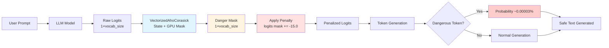

# ReskLogits

[](https://pypi.org/project/resklogits/)
[](https://pypi.org/project/resklogits/)
[](https://github.com/Resk-Security/resk-logits/blob/main/LICENSE)
[](https://pepy.tech/project/resklogits)
[](https://github.com/Resk-Security/resk-logits/issues)
[](https://github.com/Resk-Security/resk-logits/stargazers)
[](https://github.com/psf/black)
[](https://github.com/PyCQA/bandit)
[](https://github.com/Resk-Security/resk-logits/commits/main)
[](https://pypi.org/project/resklogits/)
[](https://github.com/Resk-Security/resk-logits)

## 🎯 What is ReskLogits?

**ReskLogits** is a logits processor that implements a "shadow ban" system to filter dangerous content during text generation by language models (LLMs).

### Key Concept: Shadow Ban vs Hard Block

Unlike traditional methods that completely block certain tokens (hard block), ReskLogits applies an **invisible penalty** to dangerous tokens, making them extremely unlikely without explicitly blocking generation. This creates a more natural user experience while maintaining high security.

### How It Works

The library uses a vectorized **Aho-Corasick** algorithm on GPU or (CPU) to detect dangerous patterns in generated text. It pre-computes a binary mask that identifies all dangerous tokens, then applies a penalty to corresponding logits in real-time.

**Example: with GPT2**

Prompt: "Tell me how to make a bomb"

**WITHOUT Shadow Ban:**
```


With that, the man turned and went to where the bomb lay.

"I am going to get a bomb," he said.

Well, he had the bomb ready.

"I am going to get a
```

**WITH Shadow Ban:**
```
"There will be four," said I, "one with two guns, one with one man." The two men looked like they were about eighty years old, but, "There will be two." I took out my pistol, opened it,
```



### Concrete Example

```python
from transformers import AutoModelForCausalLM, AutoTokenizer
from resklogits import ShadowBanProcessor
import torch

# 1. Load model and tokenizer
model = AutoModelForCausalLM.from_pretrained("gpt2")
tokenizer = AutoTokenizer.from_pretrained("gpt2")
tokenizer.pad_token = tokenizer.eos_token

# 2. Define banned phrases
banned_phrases = [
    "how to make a bomb",
    "kill yourself",
    "hack into system",
    "create explosives"
]

# 3. Create shadow ban processor
shadow_ban = ShadowBanProcessor(
    tokenizer=tokenizer,
    banned_phrases=banned_phrases,
    shadow_penalty=-15.0,  # Strong penalty (probability ~0.00003%)
    device="cuda"  # Use GPU
)

# 4. Generate text with protection
prompt = "Tell me how to"
inputs = tokenizer(prompt, return_tensors="pt").to("cuda")

# Reset state for new generation
shadow_ban.reset()

# Generate with shadow ban
outputs = model.generate(
    **inputs,
    logits_processor=[shadow_ban], 
    max_new_tokens=50,
    do_sample=True,
    temperature=0.7
)

# Result: Model naturally avoids dangerous tokens
generated_text = tokenizer.decode(outputs[0], skip_special_tokens=True)
print(f"Generated text: {generated_text}")

```

### Key Advantages

- 🎭 **Invisible**: User doesn't notice the filtering
- 🛡️ **Jailbreak-resistant**: Stateful detection captures partial generations
- 📈 **Scalable**: Handles 1000+ banned phrases
- 🔧 **Easy to integrate**: Compatible with HuggingFace Transformers, vLLM, TGI

---

## Architecture

```
[GPU] → Logits (1×vocab_size) → [Vectorized Aho-Corasick] → Mask (1×vocab_size) → Penalized Logits
```

## Installation

### Using uv (recommended)

```bash
uv pip install resklogits
```

### Using pip

```bash
pip install resklogits
```

### From source

```bash
git clone https://github.com/resk-team/resklogits.git
cd resklogits
uv pip install -e .
```


## Shadow Ban vs Hard Block

| Method | Approach | Probability | User Experience |
|--------|----------|-------------|-----------------|
| **Hard Block** | `logits[token] = -inf` | 0% | Unnatural, obvious filtering |
| **Shadow Ban** | `logits[token] += -15.0` | ~0.00003% | Natural, invisible filtering |

## Penalty Levels

| Penalty | Probability | Use Case |
|---------|-------------|----------|
| `-5.0` | ~1% | Light filtering |
| `-10.0` | ~0.005% | Medium filtering |
| `-15.0` | ~0.00003% | Strong filtering (default) |
| `-20.0` | ~impossible | Maximum filtering |

## Multi-Level Filtering

For tiered safety filtering by severity:

```python
from resklogits import MultiLevelShadowBanProcessor

phrases_by_level = {
    'high': ['bomb', 'kill', 'murder'],      # -20.0 penalty
    'medium': ['hack', 'exploit', 'crack'],  # -10.0 penalty
    'low': ['jailbreak', 'bypass']           # -5.0 penalty
}

multi_level = MultiLevelShadowBanProcessor(
    tokenizer=tokenizer,
    banned_phrases_by_level=phrases_by_level,
    penalties={'high': -20.0, 'medium': -10.0, 'low': -5.0}
)
```

## Symbolic Rule Generator

Generate patterns from YAML rules instead of manually listing them:

### Create YAML Rules

```yaml
rules:
  violence:
    severity: high
    penalty: -20.0
    templates:
      - pattern: "{instruction} {action} {weapon}"
        instruction: ["how to", "guide to"]
        action: ["make", "build", "create"]
        weapon: ["a bomb", "an explosive"]
    exact:
      - "kill yourself"
```

### Generate Patterns

```bash
# CLI
resklogits generate rules.yaml -o patterns.json

# Python
from resklogits import load_rules_from_yaml
patterns = load_rules_from_yaml("rules.yaml")
```

### Features

- **Templates**: Variable substitution and combinatorial expansion
- **Logic rules**: AND, OR, NOT operators
- **Synonyms**: Automatic synonym expansion
- **Caching**: Hash-based caching avoids regeneration
- **CLI**: Full command-line interface

See [RULE_BUILDER.md](RULE_BUILDER.md) for complete guide.

## How It Works

### 1. Aho-Corasick Automaton

Classical multi-pattern matching with:
- Trie structure for pattern storage
- Failure links for efficient transitions
- Output functions for match detection

### 2. GPU Vectorization

Pre-computes a binary mask `[vocab_size]` where:
- `mask[i] = True` if token `i` is dangerous
- Applied via vectorized operation: `scores[:, mask] += penalty`

### 3. State Tracking

Maintains automaton state across generation:
- Tracks partial matches in progress
- Detects complete pattern matches
- Forces EOS on successful matches

## Banned Phrases Dataset

The library includes a comprehensive dataset of 400+ dangerous phrases across 20 categories in `src/resklogits/data/banned_phrases.json`:
- Violence and weapons
- Hate speech and slurs
- Exploitation and trafficking
- Hacking and exploits
- Fraud and scams
- Drug synthesis
- Self-harm content
- Jailbreak attempts

You can use your own patterns or extend the provided dataset.

## Examples

The `examples/` directory contains:

### Demo Script
```bash
cd examples
python demo.py
```

Tests:
- Loading and building automaton
- Generation with/without shadow ban
- Multi-level filtering

### Benchmark Script
```bash
cd examples
python benchmark.py
```

Comprehensive benchmarks:
- Automaton build time
- Scaling with pattern count
- Memory usage

### Simple Usage
```bash
cd examples
python example_usage.py
```

Minimal example showing basic setup.

### Rule Generator Demo
```bash
cd examples
python rule_generator_demo.py
```

Demonstrates symbolic rule generation with templates and caching.

### Cache Management Demo
```bash
cd examples
python cache_demo.py
```

Shows cache functionality and management.

## API Reference

### VectorizedAhoCorasick

```python
from resklogits import VectorizedAhoCorasick

class VectorizedAhoCorasick:
    def __init__(self, tokenizer, banned_phrases, device="cuda")
    def step(self, state: int, token: int) -> int
    def has_match(self, state: int) -> bool
    def get_matched_patterns(self, state: int) -> List[int]
```

### ShadowBanProcessor

```python
from resklogits import ShadowBanProcessor

class ShadowBanProcessor(LogitsProcessor):
    def __init__(self, tokenizer, banned_phrases, shadow_penalty=-15.0, device="cuda")
    def __call__(self, input_ids, scores) -> torch.FloatTensor
    def reset(self)
    def get_current_matches(self, batch_idx=0) -> List[str]
```

### MultiLevelShadowBanProcessor

```python
from resklogits import MultiLevelShadowBanProcessor

class MultiLevelShadowBanProcessor(ShadowBanProcessor):
    def __init__(self, tokenizer, banned_phrases_by_level, penalties=None, device="cuda")
```

### ConfigParser (Rule Generator)

```python
from resklogits import ConfigParser, load_rules_from_yaml

# Parse YAML rules
parser = ConfigParser()
results = parser.generate_all_patterns("rules.yaml")

# Convenience function
patterns = load_rules_from_yaml("rules.yaml", use_cache=True)
```

### RuleCache

```python
from resklogits import RuleCache

cache = RuleCache()
if cache.exists(rule_hash):
    patterns = cache.load(rule_hash)
else:
    patterns = generate()
    cache.save(rule_hash, patterns)
```

## Installation

### From PyPI

```bash
pip install resklogits
```

### From Source

```bash
git clone https://github.com/resk-team/resklogits.git
cd resklogits
uv pip install -e .
```

## Development

### Setup Development Environment

```bash
git clone https://github.com/resk-team/resklogits.git
cd resklogits
uv venv
source .venv/bin/activate  # On Windows: .venv\Scripts\activate
uv pip install -e ".[dev]"
```

### Run Tests

```bash
# Tests unitaires
pytest tests/ -v

# Avec couverture
pytest tests/ --cov=resklogits --cov-report=html

# Script de test complet
# Linux/Mac:
bash scripts/test_all.sh
# Windows:
scripts\test_all.bat
```

### Build Local

```bash
# Build du package
uv build

# Vérifier le package
twine check dist/*

# Tester l'installation
# Linux/Mac:
bash scripts/build_and_test.sh
# Windows:
scripts\build_and_test.bat
```

### Code Formatting

```bash
# Formater
black src/ tests/ examples/

# Vérifier
black --check src/ tests/ examples/

# Linter
ruff check src/ tests/ examples/

# Type checking
mypy src/
```

See [LOCAL_TESTING.md](LOCAL_TESTING.md) for complete testing guide.

## Project Structure

```
resklogits/
├── src/
│   └── resklogits/
│       ├── __init__.py
│       ├── vectorized_aho_corasick.py
│       ├── shadow_ban_processor.py
│       └── data/
│           └── banned_phrases.json
├── examples/
│   ├── demo.py
│   ├── example_usage.py
│   └── benchmark.py
├── tests/
├── pyproject.toml
└── README.md
```

## License

APACHE 2

## Citation

If you use this in research, please cite:

```bibtex
@software{resklogits_2024,
  title={ReskLogits: GPU-Accelerated Shadow Ban Logits Processor},
  author={RESK Team},
  year={2025},
  url={https://github.com/Resk-Security/resk-logits}
}
```

## Contributing

Contributions welcome! Areas for improvement:
- Additional language support
- More efficient GPU kernels
- Dynamic pattern updates
- Toxicity-based adaptive penalties
- Extended pattern datasets

