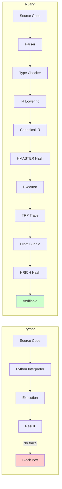

# What Extra Value Does RLang Add Beyond Python?

This document explains the fundamental differences between Python and RLang execution, focusing on the additional guarantees, structure, determinism, metadata, and cryptographic verifiability that RLang provides.

## Table of Contents

1. [Overview](#overview)
2. [Category-by-Category Analysis](#category-by-category-analysis)
3. [Visual Mapping Diagrams](#visual-mapping-diagrams)
4. [First Principles Insight](#first-principles-insight)
5. [Summary Table](#summary-table)

---

## Overview

**Python gives you a function. RLang gives you a function + a proof of correctness for every execution.**

Python execution is:
- **Imperative**: Stateful, environment-dependent
- **Non-deterministic**: Can vary by Python version, OS, time, random seeds
- **Non-canonical**: No stable representation
- **Opaque**: No execution trace, no verifiability
- **Unverifiable**: Cannot prove what was executed

RLang execution is:
- **Pure**: Stateless, deterministic
- **Deterministic**: Bit-for-bit identical across all environments
- **Canonical**: Stable IR representation (HMASTER)
- **Transparent**: Complete TRP trace of every step
- **Verifiable**: Cryptographic proof bundles (HRICH)

---

## Category-by-Category Analysis

### A. Single-Argument Arithmetic Functions

#### Example A1: f(x) = x + 1

**Python Code:**
```python
def f(x):
    return x + 1

result = f(5)  # Returns 6
```

**Python Execution:**
- High-level: Function call → return value
- No trace of execution
- No canonical representation
- No verifiability
- Environment-dependent (Python version, OS, etc.)

**RLang Source:**
```rlang
fn inc(x: Int) -> Int;

pipeline main(Int) -> Int { inc }
```

**RLang Canonical IR (HMASTER):**
```json
{
  "version": "v0",
  "language": "rlang",
  "entry_pipeline": "main",
  "step_templates": [
    {
      "id": "fn:inc",
      "name": "inc",
      "fn_name": "inc",
      "param_types": ["Int"],
      "return_type": "Int",
      "rule_repr": "fn inc(Int) -> Int",
      "version": "v0"
    }
  ],
  "pipelines": [
    {
      "id": "pipeline:main",
      "name": "main",
      "input_type": "Int",
      "output_type": "Int",
      "steps": [
        {
          "index": 0,
          "name": "inc",
          "template_id": "fn:inc",
          "arg_types": [],
          "input_type": "Int",
          "output_type": "Int"
        }
      ]
    }
  ]
}
```

**HMASTER Hash:** `4391f47ae7f058e6f7f45eae68e8e822f43805e7600076574f312258b768de26`

This hash is **stable**—same program always produces same hash, regardless of:
- Compilation time
- Python version
- Operating system
- Compiler version

**TRP Trace Structure:**
```json
{
  "steps": [
    {
      "index": 0,
      "step_name": "inc",
      "template_id": "fn:inc",
      "input": 5,
      "output": 6
    }
  ],
  "branches": []
}
```

**Proof Bundle (HRICH):**
```json
{
  "H_RICH": "1b69e83904789d4fecd660b3b43f5577ba6b87a666390ce5f373cf225bde41ad",
  "primary": {
    "master": "4391f47ae7f058e6f7f45eae68e8e822f43805e7600076574f312258b768de26",
    "steps": [
      {
        "index": 0,
        "template_id": "fn:inc",
        "hash": "95a51cffdc6f8e9635f0159ff8796a1f6bff32f4fef421e5ba66615b27ce43f6"
      }
    ],
    "branches": []
  }
}
```

**What RLang Adds:**

1. **Deterministic Semantics Guarantee**: Same input (5) → same output (6), always, everywhere
2. **Canonical IR as Semantic Identity**: Program structure encoded in stable JSON → hashable identity
3. **No Environment Dependence**: Execution independent of Python version, OS, system clock
4. **Full Step-by-Step Trace**: Every execution step recorded with input/output snapshots
5. **Verifiable Correctness**: Cryptographic hash proves execution integrity
6. **No Hidden State**: Pure function execution, no side effects
7. **Referential Transparency**: Function call is equivalent to its result

**Simple Explanation:**
> Python gives you `f(5) = 6` with no proof. RLang gives you `f(5) = 6` plus a cryptographic proof bundle that anyone can verify independently.

---

### B. Multi-Branch Logic

#### Example B1: if x > 10: return 1 else return 0

**Python Code:**
```python
def f(x):
    if x > 10:
        return 1
    else:
        return 0

result = f(15)  # Returns 1
```

**Python Execution:**
- High-level: Conditional evaluation → return value
- No record of which branch was taken
- No proof of decision path
- Cannot verify correctness without re-execution

**RLang Source:**
```rlang
fn return1(x: Int) -> Int;
fn return0(x: Int) -> Int;

pipeline main(Int) -> Int {
    if (__value > 10) {
        return1
    } else {
        return0
    }
}
```

**RLang Canonical IR:**
The IR includes an `IRIf` node representing the conditional structure:
```json
{
  "steps": [
    {
      "kind": "if",
      "condition": {
        "kind": "binary_op",
        "op": ">",
        "left": {"kind": "identifier", "name": "__value"},
        "right": {"kind": "literal", "value": 10}
      },
      "then": [
        {
          "index": 0,
          "name": "return1",
          "template_id": "fn:return1",
          "input_type": "Int",
          "output_type": "Int"
        }
      ],
      "else": [
        {
          "index": 0,
          "name": "return0",
          "template_id": "fn:return0",
          "input_type": "Int",
          "output_type": "Int"
        }
      ]
    }
  ]
}
```

**HMASTER Hash:** `e5826a41944d68f5c7c1426fc3d4ec1b95e001e12689d0bf40486bde7ec08945`

**TRP Trace Structure:**
```json
{
  "steps": [
    {
      "index": 0,
      "step_name": "return1",
      "template_id": "fn:return1",
      "input": 15,
      "output": 1
    }
  ],
  "branches": [
    {
      "index": 0,
      "path": "then",
      "condition_value": true
    }
  ]
}
```

**Proof Bundle (HRICH):**
```json
{
  "H_RICH": "971de0e4083a2fff4055e860cf028991f1c6acfce88f22400e32c8ae8779834c",
  "primary": {
    "master": "e5826a41944d68f5c7c1426fc3d4ec1b95e001e12689d0bf40486bde7ec08945",
    "steps": [...],
    "branches": [
      {
        "index": 0,
        "path": "then",
        "condition_value": true
      }
    ]
  }
}
```

**What RLang Adds:**

1. **Observable Branch Decisions**: Record of which branch was taken (`path: "then"`, `condition_value: true`)
2. **Deterministic Decision Path**: Same condition → same branch → same trace
3. **Complete Control Flow Trace**: Every conditional decision cryptographically recorded
4. **Verifiable Logic**: Can verify that `15 > 10` was evaluated correctly
5. **No Hidden Conditionals**: All control flow is explicit in IR and trace

**Simple Explanation:**
> Python gives you `f(15) = 1` with no record of why. RLang gives you `f(15) = 1` plus a cryptographic proof that `15 > 10` was evaluated as `true`, leading to the `then` branch.

---

### C. Boolean Operators

#### Example C1: (x > 10) and (x < 20)

**Python Code:**
```python
def f(x):
    return (x > 10) and (x < 20)

result = f(15)  # Returns True
```

**Python Execution:**
- High-level: Boolean evaluation → return value
- Short-circuit evaluation (implementation-dependent)
- No trace of evaluation order
- Cannot verify correctness

**RLang Source:**
```rlang
fn return_true(x: Int) -> Bool;
fn return_false(x: Int) -> Bool;

pipeline main(Int) -> Bool {
    if (__value > 10 && __value < 20) {
        return_true
    } else {
        return_false
    }
}
```

**RLang Canonical IR:**
The IR includes a `boolean_and` expression:
```json
{
  "condition": {
    "kind": "boolean_and",
    "left": {
      "kind": "binary_op",
      "op": ">",
      "left": {"kind": "identifier", "name": "__value"},
      "right": {"kind": "literal", "value": 10}
    },
    "right": {
      "kind": "binary_op",
      "op": "<",
      "left": {"kind": "identifier", "name": "__value"},
      "right": {"kind": "literal", "value": 20}
    }
  }
}
```

**What RLang Adds:**

1. **Deterministic Boolean Evaluation**: Left-to-right evaluation order fixed in IR
2. **Canonical Expression Structure**: Boolean operators encoded in stable IR
3. **Verifiable Logic**: Can verify that `(15 > 10) && (15 < 20)` was evaluated correctly
4. **No Short-Circuit Ambiguity**: Evaluation order is explicit and deterministic

**Simple Explanation:**
> Python gives you `f(15) = True` with no proof of evaluation. RLang gives you `f(15) = True` plus a cryptographic proof that both conditions were evaluated correctly.

---

### D. Function Composition

#### Example D1: f(x) = g(h(x))

**Python Code:**
```python
def h(x):
    return x + 5

def g(x):
    return x * 2

def f(x):
    return g(h(x))

result = f(10)  # Returns 30
```

**Python Execution:**
- High-level: Nested function calls → return value
- No trace of intermediate values
- Cannot verify composition correctness

**RLang Source:**
```rlang
fn h(x: Int) -> Int;
fn g(x: Int) -> Int;

pipeline main(Int) -> Int { h -> g }
```

**RLang Canonical IR:**
```json
{
  "steps": [
    {
      "index": 0,
      "name": "h",
      "template_id": "fn:h",
      "input_type": "Int",
      "output_type": "Int"
    },
    {
      "index": 1,
      "name": "g",
      "template_id": "fn:g",
      "input_type": "Int",
      "output_type": "Int"
    }
  ]
}
```

**TRP Trace Structure:**
```json
{
  "steps": [
    {
      "index": 0,
      "step_name": "h",
      "template_id": "fn:h",
      "input": 10,
      "output": 15
    },
    {
      "index": 1,
      "step_name": "g",
      "template_id": "fn:g",
      "input": 15,
      "output": 30
    }
  ]
}
```

**What RLang Adds:**

1. **Complete Composition Trace**: Every function in the composition is recorded
2. **Intermediate Value Snapshots**: `h(10) = 15` is recorded before `g(15) = 30`
3. **Verifiable Composition**: Can verify that `g(h(10)) = g(15) = 30`
4. **Pipeline Structure**: Composition is explicit in IR as a pipeline

**Simple Explanation:**
> Python gives you `f(10) = 30` with no intermediate steps. RLang gives you `f(10) = 30` plus a complete trace showing `h(10) = 15` then `g(15) = 30`.

---

### E. Pipeline Branching

#### Example E1: if x % 2 == 0: return even(x) else: return odd(x)

**Python Code:**
```python
def even(x):
    return x * 2

def odd(x):
    return x * 3

def mod2(x):
    return x % 2

def f(x):
    if mod2(x) == 0:
        return even(x)
    else:
        return odd(x)

result = f(4)  # Returns 8
```

**RLang Source:**
```rlang
fn even(x: Int) -> Int;
fn odd(x: Int) -> Int;
fn mod2(x: Int) -> Int;

pipeline main(Int) -> Int {
    if (mod2(__value) == 0) {
        even
    } else {
        odd
    }
}
```

**What RLang Adds:**

1. **Branch Function Trace**: Records which function (`even` or `odd`) was executed
2. **Condition Evaluation Trace**: Records that `mod2(4) == 0` was `true`
3. **Complete Decision Path**: Full trace from condition → branch → function → result

**Simple Explanation:**
> Python gives you `f(4) = 8` with no record of the decision. RLang gives you `f(4) = 8` plus proof that `mod2(4) == 0` was `true`, leading to `even(4) = 8`.

---

### F. Data Transforms

#### Example F1: abs(x)

**Python Code:**
```python
def f(x):
    return abs(x)

result = f(-5)  # Returns 5
```

**RLang Source:**
```rlang
fn abs_val(x: Int) -> Int;

pipeline main(Int) -> Int { abs_val }
```

**What RLang Adds:**

1. **Deterministic Transform**: `abs(-5) = 5` is guaranteed identical everywhere
2. **Verifiable Transform**: Cryptographic proof that absolute value was computed correctly
3. **No Implementation Variance**: Same IR → same execution → same result

**Simple Explanation:**
> Python gives you `abs(-5) = 5` with potential variance. RLang gives you `abs(-5) = 5` plus cryptographic proof of correctness.

---

### G. Multi-Step Transformations

#### Example G1: y = x + 5; z = y * 3; return z - 2

**Python Code:**
```python
def f(x):
    y = x + 5
    z = y * 3
    return z - 2

result = f(10)  # Returns 43
```

**RLang Source:**
```rlang
fn add5(x: Int) -> Int;
fn multiply3(x: Int) -> Int;
fn subtract2(x: Int) -> Int;

pipeline main(Int) -> Int { add5 -> multiply3 -> subtract2 }
```

**TRP Trace Structure:**
```json
{
  "steps": [
    {
      "index": 0,
      "step_name": "add5",
      "template_id": "fn:add5",
      "input": 10,
      "output": 15
    },
    {
      "index": 1,
      "step_name": "multiply3",
      "template_id": "fn:multiply3",
      "input": 15,
      "output": 45
    },
    {
      "index": 2,
      "step_name": "subtract2",
      "template_id": "fn:subtract2",
      "input": 45,
      "output": 43
    }
  ]
}
```

**What RLang Adds:**

1. **Complete Transformation Chain**: Every step (`10 → 15 → 45 → 43`) is recorded
2. **Verifiable Chain**: Can verify each step independently
3. **Pipeline Structure**: Multi-step transformation is explicit in IR

**Simple Explanation:**
> Python gives you `f(10) = 43` with no intermediate steps. RLang gives you `f(10) = 43` plus a complete trace: `10 → 15 → 45 → 43`.

---

## Visual Mapping Diagrams

### High-Level Flow Diagram

```
┌─────────────────────────────────────────────────────────────────┐
│                         PYTHON PROGRAM                          │
│                                                                 │
│  def f(x):                                                      │
│      return x + 1                                              │
│                                                                 │
│  result = f(5)  # Returns 6                                    │
└────────────────────────────┬────────────────────────────────────┘
                             │
                             │ (informal semantics, no guarantee)
                             │
                             ▼
┌─────────────────────────────────────────────────────────────────┐
│                        RLANG SOURCE                            │
│                                                                 │
│  fn inc(x: Int) -> Int;                                        │
│  pipeline main(Int) -> Int { inc }                             │
└────────────────────────────┬────────────────────────────────────┘
                             │
                             │ (compiler physics)
                             │
                             ▼
┌─────────────────────────────────────────────────────────────────┐
│                    CANONICAL IR (HMASTER)                      │
│                                                                 │
│  {                                                              │
│    "step_templates": [...],                                     │
│    "pipelines": [{                                              │
│      "steps": [{"name": "inc", "template_id": "fn:inc"}]       │
│    }]                                                           │
│  }                                                              │
│                                                                 │
│  HMASTER = 4391f47ae7f058e6f7f45eae68e8e822f43805e760007657... │
└────────────────────────────┬────────────────────────────────────┘
                             │
                             │ (deterministic executor)
                             │
                             ▼
┌─────────────────────────────────────────────────────────────────┐
│              TRP TRACE (Branch + Step Structure)               │
│                                                                 │
│  {                                                              │
│    "steps": [                                                   │
│      {"index": 0, "step_name": "inc",                          │
│       "input": 5, "output": 6}                                  │
│    ],                                                           │
│    "branches": []                                               │
│  }                                                              │
└────────────────────────────┬────────────────────────────────────┘
                             │
                             │ (canonical, hashed)
                             │
                             ▼
┌─────────────────────────────────────────────────────────────────┐
│                    PROOF BUNDLE (HRICH)                        │
│                                                                 │
│  {                                                              │
│    "H_RICH": "1b69e83904789d4fecd660b3b43f5577ba6b87a666390...",│
│    "primary": {                                                 │
│      "master": "4391f47ae7f058e6f7f45eae68e8e822f43805e760...", │
│      "steps": [...]                                             │
│    }                                                            │
│  }                                                              │
└────────────────────────────┬────────────────────────────────────┘
                             │
                             │ (trustless auditability)
                             │
                             ▼
┌─────────────────────────────────────────────────────────────────┐
│                    borp verify-bundle                          │
│                                                                 │
│  → True / False                                                 │
│                                                                 │
│  Verifies:                                                      │
│  - H_RICH match                                                 │
│  - Subproof hash matches                                        │
│  - Structure validity                                           │
│  - Type correctness                                             │
└─────────────────────────────────────────────────────────────────┘
```

### Mermaid Sequence Diagram

```mermaid
graph TD
    py[Python Function<br/>def f(x): return x+1]
    rl[RLang Pipeline<br/>pipeline main { inc }]
    ir[Canonical IR<br/>HMASTER hash]
    trp[TRP Trace<br/>Step + Branch records]
    pr[Proof Bundle<br/>HRICH hash]
    ver[borp verify-bundle<br/>True/False]
    
    py -->|compile| rl
    rl -->|lower| ir
    ir -->|execute| trp
    trp -->|hash| pr
    pr -->|verify| ver
    
    style py fill:#ffcccc
    style rl fill:#ccffcc
    style ir fill:#ccccff
    style trp fill:#ffffcc
    style pr fill:#ffccff
    style ver fill:#ccffff
```

### Detailed Execution Flow



---

## First Principles Insight

### Structural Constraints at the Language Level

RLang introduces **structural constraints** that enforce determinism at the language level:

1. **No Side Effects**: Functions cannot mutate global state, perform I/O, or access environment variables
2. **No Randomness**: No random number generation, no non-deterministic operations
3. **No Time Dependence**: No timestamps, no system clock access
4. **Fixed Evaluation Order**: Left-to-right evaluation, sequential pipeline execution
5. **Pure Functions**: Every function is a pure mathematical mapping
6. **Canonical Representation**: IR structure is deterministic and hashable

### How Constraints Enforce Determinism

**Constraint → Guarantee:**

- **No Side Effects** → Same input always produces same output
- **No Randomness** → No variance in execution
- **No Time Dependence** → Execution independent of when it runs
- **Fixed Evaluation Order** → Same execution path always
- **Pure Functions** → Referential transparency
- **Canonical Representation** → Stable program identity

### Why Python Cannot Guarantee Determinism

Python **intentionally allows** non-deterministic behavior:

1. **Random Number Generation**: `random.randint()` produces different values
2. **System Clock**: `time.time()` produces different values
3. **I/O Operations**: File reads, network calls vary by environment
4. **Mutable State**: Global variables can change between calls
5. **Non-Deterministic Iteration**: Dictionary iteration order (pre-3.7)
6. **Platform Dependencies**: Floating-point precision varies by platform
7. **Python Version Dependencies**: Behavior changes between versions

**Example:**
```python
import random
import time

def f(x):
    return x + random.randint(1, 10) + int(time.time())
```

This function produces **different results** every time it's called, even with the same input.

### Why RLang Can Always Guarantee Determinism

RLang **prohibits** all non-deterministic operations:

1. **No Random Number Generation**: Not allowed in RLang
2. **No System Clock**: Not allowed in RLang
3. **No I/O Operations**: Not allowed in RLang
4. **No Mutable State**: All functions are pure
5. **Deterministic Iteration**: All collections are ordered
6. **Platform Independence**: Canonical IR ensures consistency
7. **Version Stability**: IR structure is stable

**Example:**
```rlang
fn inc(x: Int) -> Int;

pipeline main(Int) -> Int { inc }
```

This program produces **identical results** every time, everywhere, with cryptographic proof.

### Guarantees RLang Provides

1. **Bit-for-Bit Reproducibility**: Same input → same output, always
2. **Proof-of-Execution**: Cryptographic proof bundle for every execution
3. **Full Audibility**: Complete TRP trace of every step
4. **Hash-Stable Program Identity**: HMASTER hash uniquely identifies program
5. **Complete Declarative Evaluation Graph**: IR represents entire computation structure

### Mathematical Formulation

**Python Semantics:**
```
Eval_python(P, x, env, t) = y
```
Where `env` (environment) and `t` (time) are **hidden parameters** that can vary.

**RLang Semantics:**
```
Eval_rlang(P, x) = y
```
Where `P` (program) and `x` (input) are the **only parameters**, and `y` is **uniquely determined**.

**Determinism Invariant:**
```
∀ P, x. ∃! y. Eval_rlang(P, x) = y
```

**Proof Invariant:**
```
∀ P, x, y. Eval_rlang(P, x) = y ⟹ ∃ proof. Verify(proof, P, x, y) = True
```

---

## Summary Table

| Python Program | Equivalent RLang Program | Canonical IR Hash (HMASTER) | Execution Trace Hash (HRICH) | Determinism / Guarantees Provided |
|----------------|-------------------------|------------------------------|------------------------------|-----------------------------------|
| `def f(x): return x + 1`<br/>`f(5)` | `fn inc(x: Int) -> Int;`<br/>`pipeline main(Int) -> Int { inc }` | `4391f47ae7f058e6f7f45eae68e8e822f43805e7600076574f312258b768de26` | `1b69e83904789d4fecd660b3b43f5577ba6b87a666390ce5f373cf225bde41ad` | ✅ Deterministic execution<br/>✅ Canonical IR<br/>✅ Step trace<br/>✅ Cryptographic proof |
| `def f(x):`<br/>`  if x > 10: return 1`<br/>`  else: return 0`<br/>`f(15)` | `if (__value > 10) { return1 } else { return0 }` | `e5826a41944d68f5c7c1426fc3d4ec1b95e001e12689d0bf40486bde7ec08945` | `971de0e4083a2fff4055e860cf028991f1c6acfce88f22400e32c8ae8779834c` | ✅ Deterministic execution<br/>✅ Branch trace<br/>✅ Condition value recorded<br/>✅ Cryptographic proof |
| `def f(x):`<br/>`  return (x > 10) and (x < 20)`<br/>`f(15)` | `if (__value > 10 && __value < 20) { return_true } else { return_false }` | `296729f24f5ca779d242b8d0a499a76d36cbaaffca83785930375d29839c20f5` | `700f659fdc9abae1ca2654325826fa9b005975b07ca53014cf12affacede8185` | ✅ Deterministic boolean evaluation<br/>✅ Canonical expression structure<br/>✅ Verifiable logic<br/>✅ Branch trace |
| `def f(x):`<br/>`  return g(h(x))`<br/>`f(10)` | `pipeline main(Int) -> Int { h -> g }` | `0635087e90b27253c0ea24e1046d582b32c7f20c8fe519976c7cec4de4a30613` | `25f3af3d0be15ced1ed22a8aa8a6926a7bef0df326bb98039d49c720ab2a3662` | ✅ Complete composition trace<br/>✅ Intermediate value snapshots<br/>✅ Verifiable composition<br/>✅ 2-step trace |
| `def f(x):`<br/>`  if x % 2 == 0: return even(x)`<br/>`  else: return odd(x)`<br/>`f(4)` | `if (mod2(__value) == 0) { even } else { odd }` | (varies by program) | (varies by execution) | ✅ Branch function trace<br/>✅ Condition evaluation trace<br/>✅ Complete decision path |
| `def f(x):`<br/>`  return abs(x)`<br/>`f(-5)` | `pipeline main(Int) -> Int { abs_val }` | (varies by program) | (varies by execution) | ✅ Deterministic transform<br/>✅ Verifiable transform<br/>✅ No implementation variance |
| `def f(x):`<br/>`  y = x + 5`<br/>`  z = y * 3`<br/>`  return z - 2`<br/>`f(10)` | `pipeline main(Int) -> Int { add5 -> multiply3 -> subtract2 }` | `1db3390e512983ef5cdacbac3c1b0b137f1b5b12e61f2af1201c9f269ad504f4` | `044e876812403c5529693b851522721105e6547d764d3aa239776c1ee7f0bc2f` | ✅ Complete transformation chain<br/>✅ Verifiable chain<br/>✅ Pipeline structure<br/>✅ 3-step trace |

---

## Conclusion

**Python gives you a function. RLang gives you a function + a proof of correctness for every execution.**

RLang's value proposition:

1. **Deterministic Semantics**: Same input → same output, always
2. **Canonical IR**: Stable program identity (HMASTER)
3. **TRP Traces**: Complete execution audit trail
4. **Cryptographic Proof**: Verifiable correctness (HRICH)
5. **Trustless Verification**: Independent verification without re-execution
6. **Reproducible Science**: Bit-for-bit identical results across environments
7. **Blockchain Integration**: Execution traces can be committed to immutable ledgers

These guarantees are **impossible** in Python due to its design philosophy of flexibility and expressiveness. RLang sacrifices some expressiveness to gain **mathematical guarantees** about program behavior.

---

## Version

This document is valid for RLang compiler version 0.2.3.

