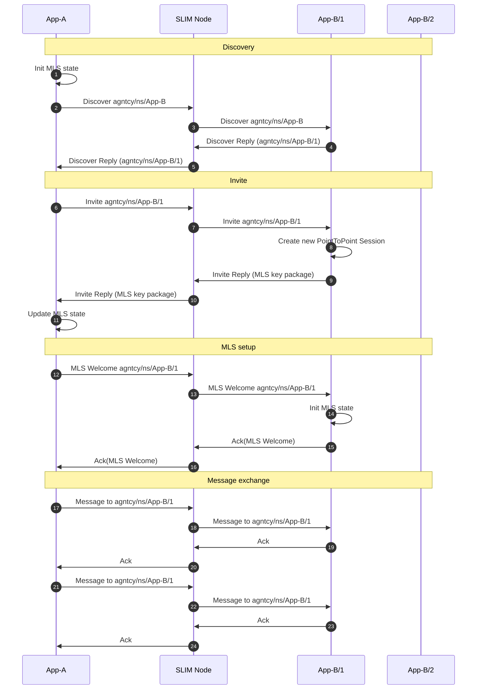
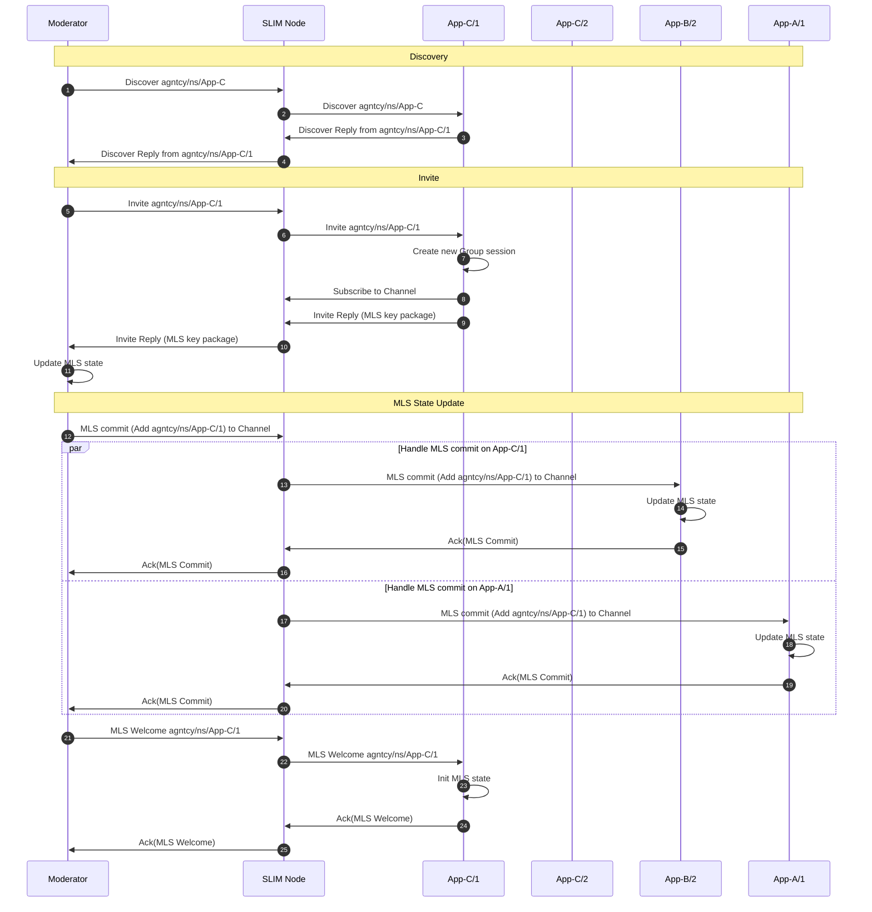
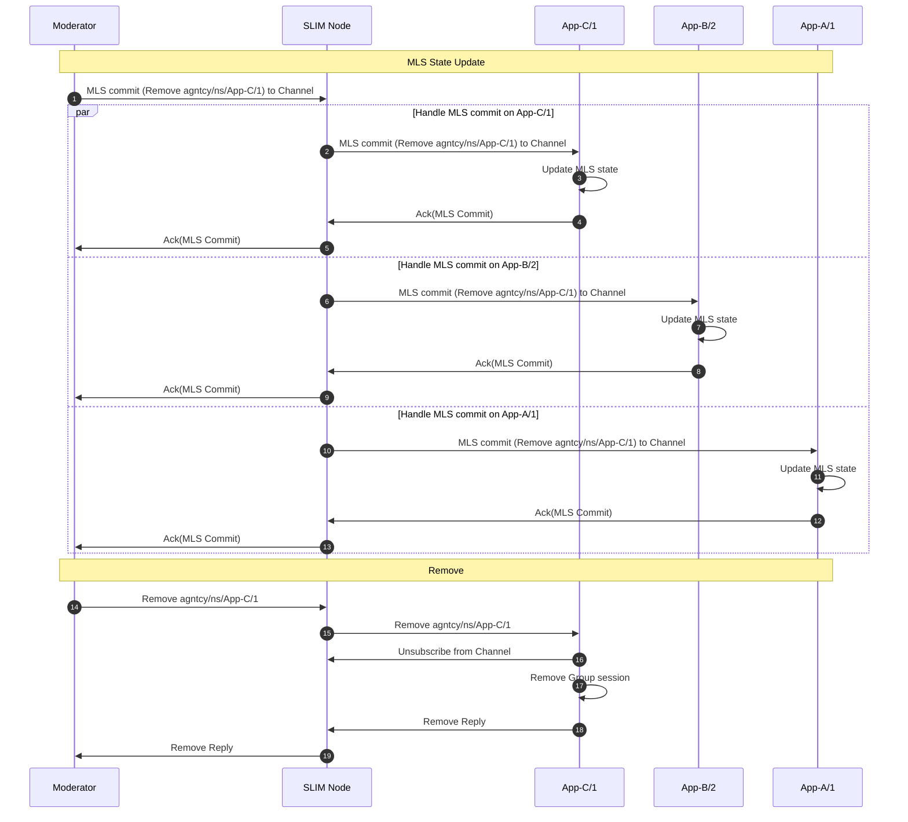

# SLIM Sessions

This document explains the SLIM session layer and the three supported session
types. It helps you pick the right pattern, understand reliability and security
trade‑offs, and shows concrete Python usage examples.

---
## Quick Reference

| Type         | Pattern        | Reliability             | MLS | Primary Uses                            | Avoid When                                 |
|--------------|----------------|-------------------------|-----|-----------------------------------------|--------------------------------------------|
| Point2Point  | 1:1 stateful   | Optional acks + retries | Yes | Stateful convo, sticky peer, secure P2P | Need broadcast / many recipients           |
| Group    | N:N channel    | Optional acks + retries | Yes | Group chat, pub/sub, coordination       | Need strict single recipient semantics     |

Key takeaways:
* Pick Point2Point when you must bind to one specific instance and optionally
    secure with MLS.
* Pick Group when many peers need to exchange messages over the same shared
    channel.

---

## Table of Contents
2. [Point2Point](#point2point)
3. [Group](#group)

---

## Point2Point

The Point2Point session enables point‑to‑point communication with a specific
instance. It performs a discovery phase to bind to one instance; all subsequent traffic in
the session targets that same endpoint. This enables stateful interactions and
session continuity. With reliability enabled each message must be Acked.

If MLS is enabled, the Point2Point session establishes a two‑member MLS group after
discovery: invite → key package reply → MLS Welcome. This mirrors the
Group flow but with only two participants.

The diagram below illustrates a PointToPoint session from App-A to agntcy/ns/App-B.
App-A first discovers an available instance (App-B/1), then performs the MLS
setup, and finally sends multiple messages to that same instance, each followed
by an Ack. If MLS is not enabled, the MLS setup is skipped:




### Create a Point2Point Session

Using the SLIM Python bindings, you can create a PointToPoint session as follows:

```python
# Assume local_app is an initialized application instance
session = await local_app.create_session(
    slim_bindings.SessionConfiguration.PointToPoint(
        peer_name=remote_name,
        max_retries=5,
        timeout=datetime.timedelta(seconds=5),
        mls_enabled=True,  # Enable MLS for end-to-end security
    )
)
```

Parameters:
* `peer_name` (required, Name): Identifier of the remote participant
    instance.
* `max_retries` (optional, int): Retry attempts per message if Ack missing.
* `timeout` (optional, timedelta): Wait per attempt for an Ack before retry.
* `mls_enabled` (optional, bool): Enable end‑to‑end encryption (MLS).

If `timeout` is not set the session is best‑effort.

### Sending and Replying

In Point2Point the session is bound to a single remote instance after discovery, so
outbound messages use the implicit destination. Use `publish` for normal sends
and `publish_to` to reply using a previously received message context.

```python
# Send a request
await session.publish(b"hello")

# Await reply from remote (pattern depends on your control loop)
msg_ctx, payload = await session.get_message()
print(payload.decode())

# Send a correlated response back (echo style)
await session.publish_to(msg_ctx, b"hi")
```

## Group

The Group session allows N:N communication on a named channel. Each
message is delivered to all current participants.

Each channel has a moderator that can add or remove participants. Moderation
can be built into your application or delegated to a separate control service
or the SLIM control plane.

Below are examples using the latest Python bindings, along with explanations of
what happens inside the session layer when a participant is added or removed
from the channel.

### Create a Group Session

To create a group session, you need to configure the session with a topic
name, set yourself as moderator if you want to manage participants, and specify
other options such as retries, timeout, and security settings. Here is an
example:

```python
# Assume local_app is an initialized application instance
session = await local_app.create_session(
    slim_bindings.SessionConfiguration.Group(
        channel_name=channel_name,
        max_retries=5,
        timeout=datetime.timedelta(seconds=5),
        mls_enabled=True,
    )
)
```

Parameters:
* `channel_name` (required, Name): Channel name where all the messages are
    delivered.
* `max_retries` (optional, int): Retry attempts for missing Acks.
* `timeout` (optional, timedelta): Wait per attempt for Ack before retry.
* `mls_enabled` (optional, bool): Enable secure group MLS messaging.

If `timeout` is not set the session is best‑effort.

### Sending and Replying in a Group Session

In a Group, the session targets a channel: all sends are broadcast to current
participants. Use `publish` to send.

```python
# Broadcast to the channel
await session.publish(b"hello")

# Handle inbound messages
msg_ctx, data = await session.get_message()
print("channel received:", data.decode())

# Reply to every participant
await session.publish(b"hi")
```

### Invite a New Participant

A moderator can invite a new participant to the channel using the `invite`
method after creating the session.

```python
# After creating the session as moderator:
invite_name = split_id(invite)  # Use the participant's ID string
await local_app.set_route(invite_name)
await session.invite(invite_name)
```

Parameter:
* `invite_name` (Name): Identifier of the participant to add.


When a moderator wants to add a new participant (e.g., an instance of App-C) to
a group session, the following steps occur. All the steps are visualized in
the diagram below:


1. **Discovery Phase:** The moderator initiates a discovery request to find a
    running instance of the desired application (App-C). This request is sent to
    the SLIM Node, which forwards it in anycast to one of the App-C instances.
    In the example, the message is forwarded to App-C/1 that replies with its
    full identifier. The SLIM Node relays this reply back to the moderator.

2. **Invitation:** The moderator sends an invite message for the discovered
    instance (App-C/1) to the SLIM Node, which forwards it to App-C/1. Upon
    receiving the invite, App-C/1 creates a new group session, subscribes to
    the channel, and replies with its MLS (Messaging Layer Security) key
    package. This reply is routed back to the moderator.

3. **MLS State Update:** The moderator initiates an MLS commit to add App-C/1
    to the secure group. The message is sent using the channel name and so the
    SLIM Node distributes this commit to all current participants (App-B/2 and
    App-A/1), who update their MLS state and acknowledge the commit. The
    moderator collects all acknowledgments. Once all acknowledgments are
    received, the moderator sends an MLS Welcome message to App-C/1. App-C/1
    initializes its MLS state and acknowledges receipt. At the end of this
    process, all participants (including the new one) share a secure group state
    and can exchange encrypted messages on the channel. If MLS is
    disabled, the MLS state update and welcome step are skipped.



### Remove a Participant


A moderator can remove a participant from the channel using the `remove`
method after creating the session.

```python
# To remove a participant from the session:
remove_name = split_id(participant)  # Use the participant's ID string
await session.remove(remove_name)
```


Parameter:
* `remove_name` (Name): Identifier of the participant to remove.


When a moderator wants to remove a participant (e.g., App-C/1) from a group
session, the following steps occur. All the steps are visualized in the diagram
below:


1. **MLS State Update:** The moderator creates an MLS commit to remove App-C/1
    from the secure group. This commit is sent to the channel and the
    SLIM Node distributes it to all current participants (App-C/1, App-B/2, and
    App-A/1). Each participant updates its MLS state and acknowledges the
    commit. The moderator collects all acknowledgments. In case the MLS is
    disabled, this step is not executed.

2. **Removal:** After the MLS state is updated, the moderator sends a remove
    message to App-C/1. Upon receiving the remove message, App-C/1 unsubscribes
    from the channel, deletes its session, and replies with a
    confirmation. The SLIM Node relays this confirmation back to the moderator.
    At the end of this process, App-C/1 is no longer a member of the
    group and cannot send or receive messages on the channel.


