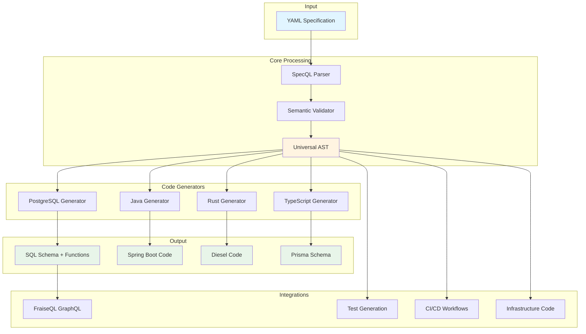
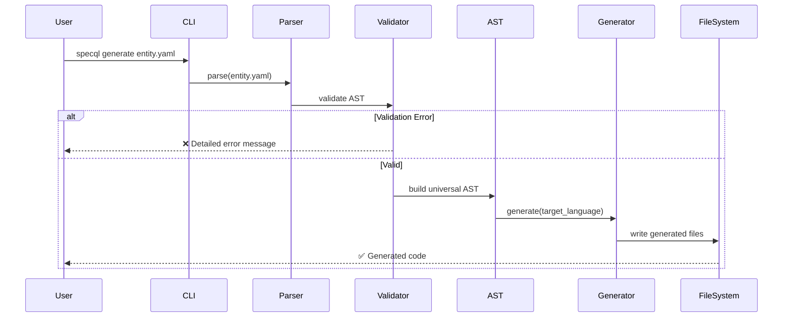
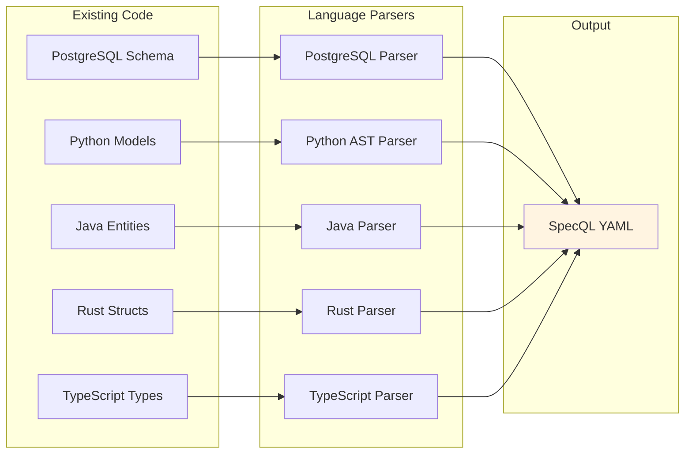
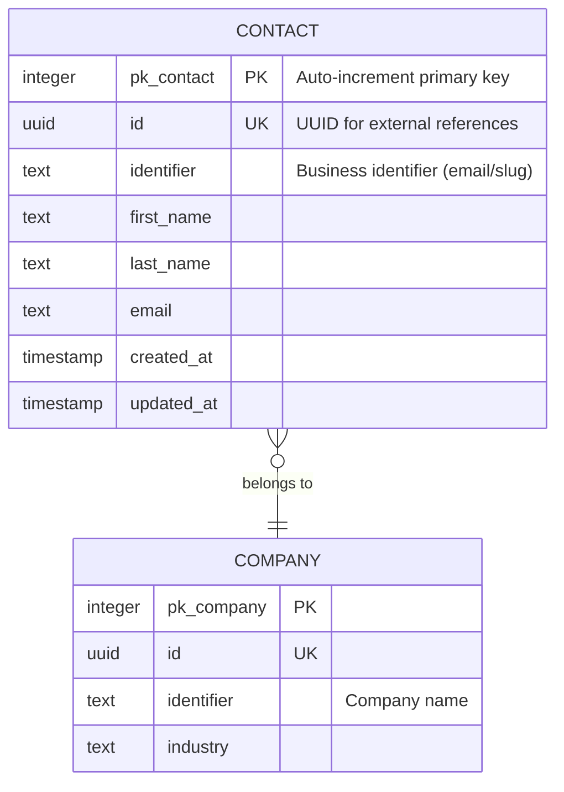
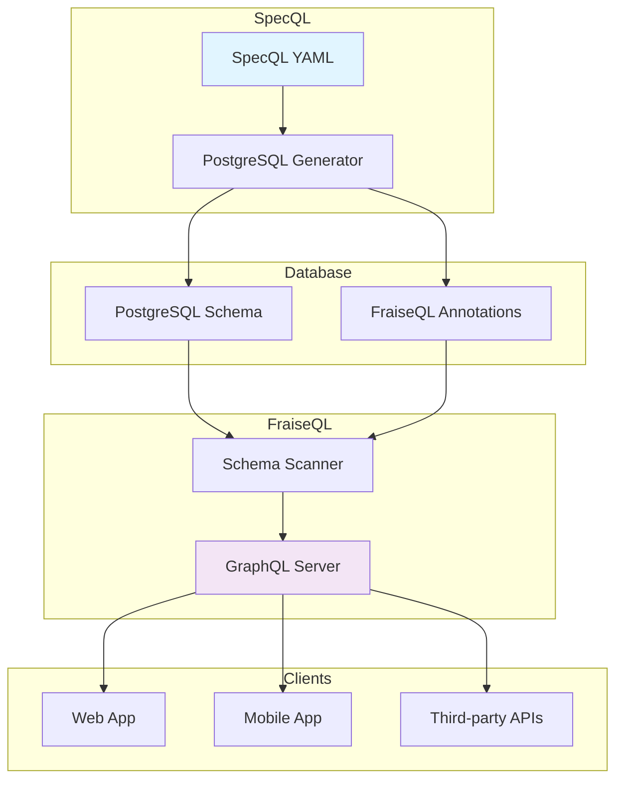

# SpecQL Architecture

## High-Level Overview

View Mermaid source

## Code Generation Flow

View Mermaid source

## Reverse Engineering Flow

View Mermaid source

## Trinity Pattern Explained

View Mermaid source

**Trinity Pattern Benefits**:
- `pk_*`: Fast joins (integer)
- `id`: External API stability (UUID)
- `identifier`: Human-readable (business key)

## FraiseQL Integration

View Mermaid source

