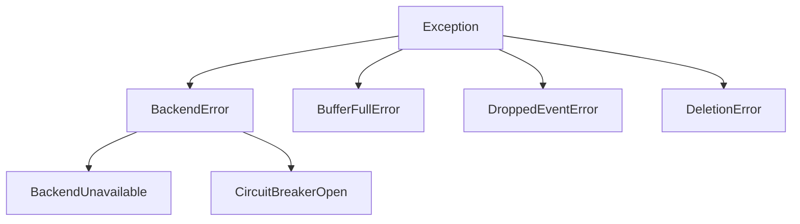

## Error Types

Token Usage Metrics defines several error types for different failure scenarios:

```python
from token_usage_metrics.errors import (
    BackendError,
    BackendUnavailable,
    CircuitBreakerOpen,
    BufferFullError,
    DroppedEventError,
    DeletionError
)
```

### Error Hierarchy



## Error Descriptions

### BackendError

Base exception for all backend-related errors.

<ParamField path="message" type="string">
  Error description
</ParamField>

<ParamField path="cause" type="Exception | None">
  Original exception if available
</ParamField>

```python
try:
    await client.log(event)
except BackendError as e:
    print(f"Backend error: {e}")
    if e.cause:
        print(f"Caused by: {e.cause}")
```

### BackendUnavailable

Backend is temporarily unavailable (connection failed, timeout, etc.).

<Info>This error triggers the circuit breaker</Info>

```python
try:
    await client.log(event)
except BackendUnavailable:
    # Backend is down, log to fallback
    logger.warning("Backend unavailable, event buffered")
```

### CircuitBreakerOpen

Circuit breaker is open, rejecting requests to protect backend.

<Tip>Wait for circuit breaker timeout before retrying</Tip>

```python
try:
    await client.log(event)
except CircuitBreakerOpen:
    # Circuit is open, backend likely down
    logger.error("Circuit breaker open, skipping event")
```

### BufferFullError

Event buffer is full and drop policy prevented enqueue.

```python
try:
    await client.log(event)
except BufferFullError:
    # Buffer full, event dropped
    logger.error("Buffer full, event lost")
    # Consider increasing buffer_size
```

### DroppedEventError

Event was dropped from buffer (informational, not raised).

<Info>This is logged, not raised. Check logs for dropped events.</Info>

```python
# Check stats for drops
stats = client.get_stats()
if stats['dropped_count'] > 0:
    logger.warning(f"Dropped {stats['dropped_count']} events")
```

### DeletionError

Error during project deletion.

```python
try:
    result = await client.delete("my_app")
except DeletionError as e:
    print(f"Deletion failed: {e}")
```

## Error Handling Patterns

### Basic Try-Catch

```python
from token_usage_metrics.errors import BackendError

try:
    await client.log("my_app", "chat", input_tokens=100, output_tokens=50)
except BackendError as e:
    logger.error(f"Failed to log event: {e}")
```

### Specific Error Handling

```python
from token_usage_metrics.errors import (
    CircuitBreakerOpen,
    BufferFullError,
    BackendUnavailable
)

try:
    await client.log("my_app", "chat", input_tokens=100, output_tokens=50)
except CircuitBreakerOpen:
    # Circuit is open, don't retry
    logger.warning("Circuit breaker open, event skipped")
except BufferFullError:
    # Buffer full, consider scaling
    logger.error("Buffer full, increase buffer_size")
except BackendUnavailable:
    # Backend down, will retry automatically
    logger.warning("Backend unavailable, event buffered")
except BackendError as e:
    # Catch-all for other backend errors
    logger.error(f"Backend error: {e}")
```

### Fire-and-Forget Pattern

<Tip>For non-critical tracking, ignore errors</Tip>

```python
async def log_usage_safe(client, project, type, input_tokens, output_tokens):
    """Log usage, ignore errors"""
    try:
        await client.log(project, type, input_tokens=input_tokens, output_tokens=output_tokens)
    except Exception as e:
        logger.debug(f"Failed to log usage: {e}")
        # Continue without tracking
```

### Fallback Pattern

```python
import aiofiles

async def log_with_fallback(client, event):
    """Log to backend, fallback to file on error"""
    try:
        await client.log(event)
    except (CircuitBreakerOpen, BackendUnavailable):
        # Fallback to file
        async with aiofiles.open("fallback.jsonl", "a") as f:
            await f.write(event.model_dump_json() + "\n")
        logger.warning("Logged to fallback file")
```

### Retry Pattern

<Info>
  The client already implements retry logic. Use this for additional
  application-level retries.
</Info>

```python
import asyncio

async def log_with_retry(client, event, max_retries=3):
    """Retry logging with exponential backoff"""
    for attempt in range(max_retries):
        try:
            await client.log(event)
            return
        except CircuitBreakerOpen:
            # Don't retry on circuit breaker
            raise
        except BackendError as e:
            if attempt == max_retries - 1:
                raise
            wait = 2 ** attempt
            logger.warning(f"Retry {attempt+1}/{max_retries} after {wait}s")
            await asyncio.sleep(wait)
```

## Monitoring Errors

### Check Client Stats

```python
stats = client.get_stats()

print(f"Queue size: {stats['queue_size']}")
print(f"Dropped count: {stats['dropped_count']}")
print(f"Circuit state: {stats['circuit_state']}")

# Alert if too many drops
if stats['dropped_count'] > 100:
    alert("Too many dropped events!")
```

### Health Check

```python
async def health_check(client):
    """Check if backend is healthy"""
    try:
        healthy = await client.health_check()
        if not healthy:
            alert("Backend health check failed")
        return healthy
    except Exception as e:
        logger.error(f"Health check error: {e}")
        return False

# Periodic health checks
while True:
    await health_check(client)
    await asyncio.sleep(60)  # Every minute
```

### Log All Errors

```python
import logging

logging.basicConfig(level=logging.INFO)
logger = logging.getLogger("token_usage_metrics")

# Errors are automatically logged by the library
# Check logs for patterns
```

## Recovery Strategies

### Circuit Breaker Recovery

<Tabs>
  <Tab title="Automatic">
    The circuit breaker automatically recovers: ```python # Circuit opens after
    5 failures # After 60 seconds, enters half-open state # One success closes
    the circuit ```
  </Tab>

  <Tab title="Manual Check">
    ```python stats = client.get_stats() if stats['circuit_state'] == 'open':
    logger.warning("Circuit breaker is open") # Wait for automatic recovery
    await asyncio.sleep(60) ```
  </Tab>
</Tabs>

### Buffer Overflow Recovery

```python
# Monitor queue size
stats = client.get_stats()
if stats['queue_size'] > 800:  # 80% full
    logger.warning("Buffer nearly full, flushing")
    await client.flush()

# Increase buffer size if needed
settings = Settings(
    buffer_size=2000  # Increase from default 1000
)
```

### Backend Reconnection

```python
async def ensure_connected(client):
    """Ensure backend connection is healthy"""
    try:
        healthy = await client.health_check()
        if not healthy:
            logger.warning("Backend unhealthy, reconnecting...")
            # Client automatically reconnects on next operation
    except Exception as e:
        logger.error(f"Connection check failed: {e}")
```

## Best Practices

<AccordionGroup>
  <Accordion title="Don't Block on Errors">
    Logging should not block your application:
    
    ```python
    # ✅ Good - fire and forget
    try:
        await client.log(event)
    except Exception:
        pass  # Continue processing
    
    # ❌ Bad - blocks on error
    await client.log(event)  # No error handling
    ```
  </Accordion>
  
  <Accordion title="Monitor Dropped Events">
    Alert when too many events are dropped:
    
    ```python
    stats = client.get_stats()
    if stats['dropped_count'] > 100:
        alert("High drop rate detected!")
    ```
  </Accordion>
  
  <Accordion title="Use Health Checks">
    Periodically verify backend health:
    
    ```python
    # In a background task
    while True:
        await client.health_check()
        await asyncio.sleep(60)
    ```
  </Accordion>
  
  <Accordion title="Log Error Context">
    Include context in error logs:
    
    ```python
    try:
        await client.log(event)
    except BackendError as e:
        logger.error(
            "Failed to log event",
            extra={
                "project": event.project_name,
                "error": str(e),
                "circuit_state": client.get_stats()['circuit_state']
            }
        )
    ```
  </Accordion>
</AccordionGroup>

## Testing Error Scenarios

### Simulate Backend Failure

```python
# Stop backend (e.g., Redis)
# Client will buffer events and circuit breaker will open

await client.log(event)  # Buffered
await client.log(event)  # Buffered
# ... after 5 failures, circuit opens
await client.log(event)  # Raises CircuitBreakerOpen
```

### Simulate Buffer Overflow

```python
settings = Settings(buffer_size=10)  # Small buffer
client = await TokenUsageClient.from_settings(settings)

# Fill buffer
for i in range(15):
    try:
        await client.log("app", "test", input_tokens=i, output_tokens=i)
    except BufferFullError:
        print(f"Buffer full at event {i}")
```

### Test Retry Logic

```python
# Temporarily break backend connection
# Client will retry with exponential backoff
# After max_retries, raises error
```

## Common Error Scenarios

<Tabs>
  <Tab title="Backend Down">
    **Symptoms:** - `BackendUnavailable` errors - Circuit breaker opens - Events
    buffer in memory **Recovery:** - Wait for backend to recover - Circuit
    breaker auto-recovers after timeout - Buffered events flush automatically
  </Tab>

  <Tab title="High Load">
    **Symptoms:** - Buffer fills up - Events dropped - High queue size
    **Recovery:** - Increase `buffer_size` - Increase `flush_batch_size` - Scale
    backend (more Redis nodes, etc.)
  </Tab>

  <Tab title="Network Issues">
    **Symptoms:** - Timeout errors - Intermittent failures - Circuit breaker
    flapping **Recovery:** - Increase timeouts - Check network connectivity -
    Increase `circuit_breaker_timeout`
  </Tab>
</Tabs>

<CardGroup cols={2}>
  <Card
    title="Previous: Configuration"
    icon="sliders"
    href="/advanced/configuration"
  >
    Advanced configuration reference
  </Card>
  <Card
    title="Next: Performance"
    icon="gauge-high"
    href="/advanced/performance"
  >
    Performance tuning guide
  </Card>
</CardGroup>
