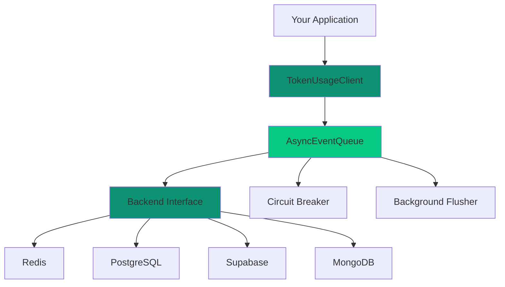
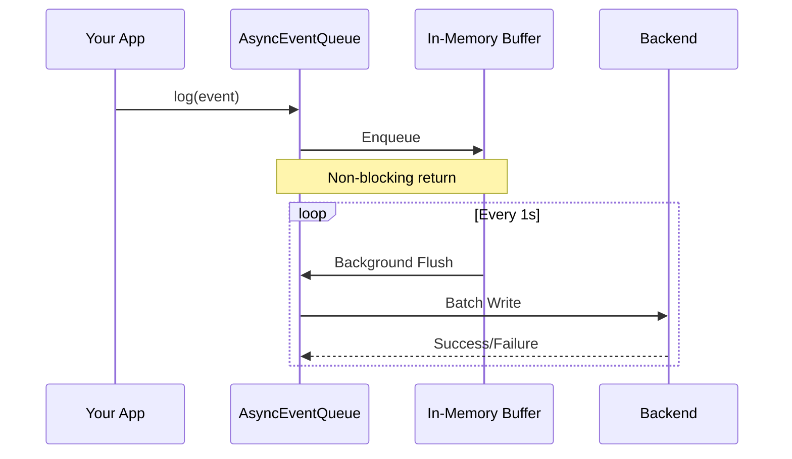
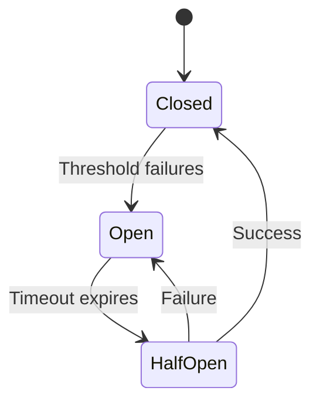
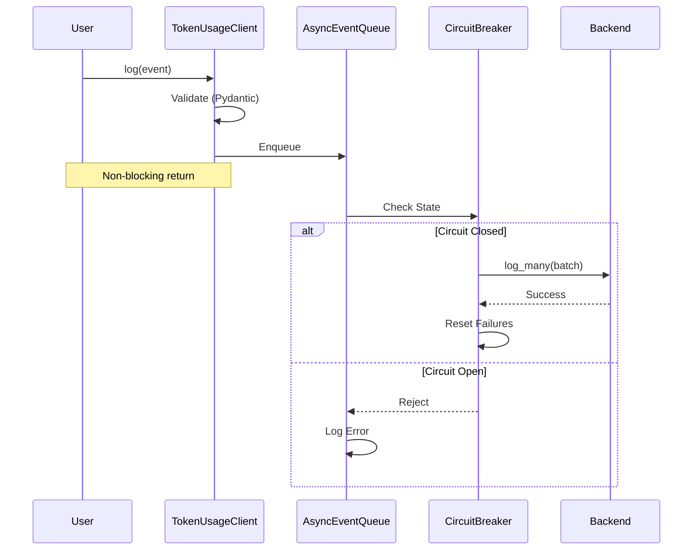
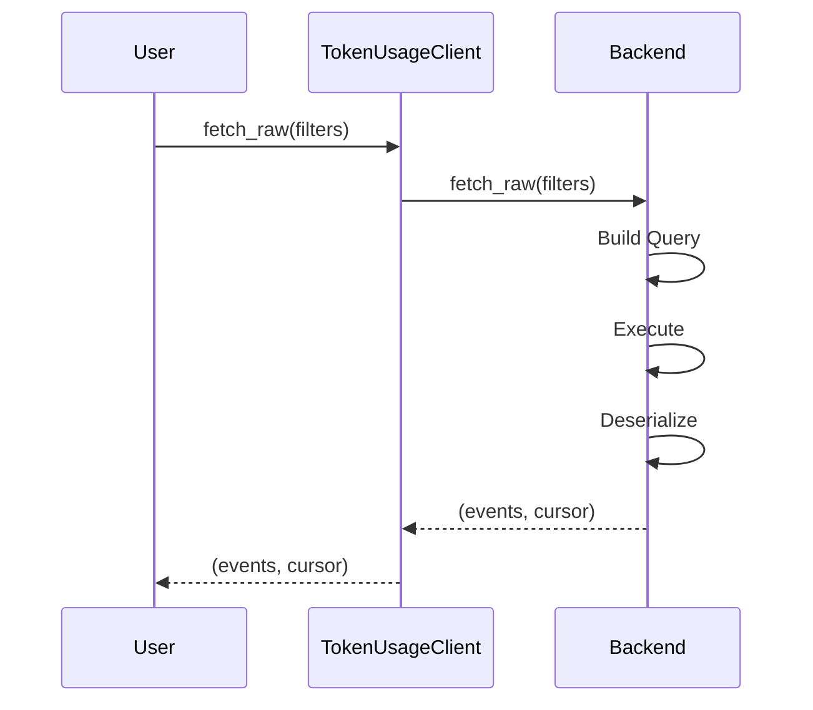
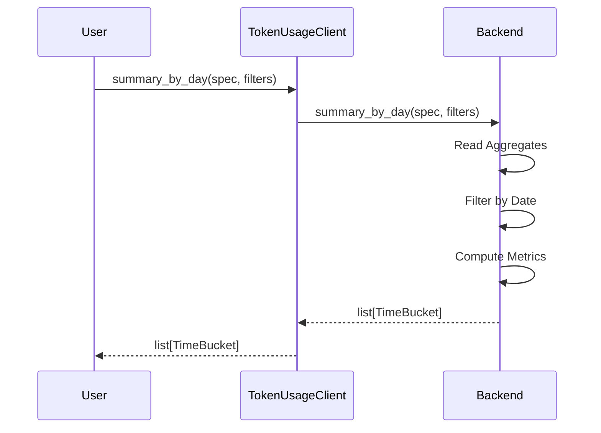

## System Overview



<Info>
  The architecture follows a layered design with clear separation of concerns,
  making it easy to extend and maintain.
</Info>

## Components

### 1. TokenUsageClient

**Responsibility:** High-level API for users

<AccordionGroup>
  <Accordion title="Features">
    - Lifecycle management (start/stop) - Async context manager support -
    Backend factory and initialization - Unified interface across all backends
  </Accordion>

  <Accordion title="Key Methods">
    - `log()`, `log_many()` - Enqueue events - `fetch_raw()` - Query raw events
    - `summary_*()` - Query aggregates - `delete_project()` - Delete data -
    `flush()`, `health_check()`, `get_stats()` - Utilities
  </Accordion>
</AccordionGroup>

### 2. AsyncEventQueue

**Responsibility:** Non-blocking event buffering with resilience

<CardGroup cols={2}>
  <Card title="Bounded Queue" icon="box">
    In-memory buffer with configurable size
  </Card>
  <Card title="Background Flusher" icon="clock">
    Periodic batching for efficiency
  </Card>
  <Card title="Drop Policies" icon="trash">
    Oldest/newest when buffer is full
  </Card>
  <Card title="Circuit Breaker" icon="shield">
    Integrated failure protection
  </Card>
</CardGroup>

#### Flow Diagram



### 3. CircuitBreaker

**Responsibility:** Prevent cascading failures

#### States

<Steps>
  <Step title="Closed (Normal)">All requests pass through normally</Step>
  <Step title="Open (Failed)">
    Too many failures detected, requests rejected immediately
  </Step>
  <Step title="Half-Open (Testing)">
    After timeout, test if backend has recovered
  </Step>
</Steps>



<Tip>
  The circuit breaker helps your application degrade gracefully when backends
  are unavailable.
</Tip>

### 4. Backend Interface

**Responsibility:** Abstract storage operations

#### Required Methods

<CodeGroup>

```python Lifecycle
async def connect() -> None
async def disconnect() -> None
async def health_check() -> bool
```

```python Write Operations
async def log_many(events: list[UsageEvent]) -> None
```

```python Read Operations
async def fetch_raw(filters: UsageFilter) -> tuple[list[UsageEvent], str | None]
async def summary_by_day(spec: AggregateSpec, filters: UsageFilter) -> list[TimeBucket]
async def summary_by_project(spec: AggregateSpec, filters: UsageFilter) -> list[SummaryRow]
async def summary_by_request_type(spec: AggregateSpec, filters: UsageFilter) -> list[SummaryRow]
```

```python Delete Operations
async def delete_project(options: DeleteOptions) -> DeleteResult
```

</CodeGroup>

## Backend Implementations

### Redis Backend

<Tabs>
  <Tab title="Schema">
    #### Event Storage
    ```text
    tum:e:{id} → Hash {
        id, ts, project, type,
        input, output, total, count, metadata
    }
    ```
    
    #### Indexes (Day-Partitioned ZSETs)
    ```text
    tum:ts:{YYYYMMDD} → {id: timestamp_score}
    tum:proj:{project}:{YYYYMMDD} → {id: timestamp_score}
    tum:type:{type}:{YYYYMMDD} → {id: timestamp_score}
    ```
    
    #### Daily Aggregates (Hashes)
    ```text
    tum:agg:{YYYYMMDD} → {input_tokens, output_tokens, ...}
    tum:agg:{YYYYMMDD}:proj:{project} → {...}
    tum:agg:{YYYYMMDD}:type:{type} → {...}
    tum:agg:{YYYYMMDD}:proj:{p}:type:{t} → {...}
    ```
  </Tab>
  
  <Tab title="Write Path">
    1. Pipeline: HSET event
    2. ZADD to 3 indexes
    3. HINCRBY to 4 aggregates
    
    <Info>
      ~10 Redis ops per event (pipelined for efficiency)
    </Info>
  </Tab>
  
  <Tab title="Read Path">
    - **Raw:** ZRANGEBYSCORE on narrowest index → HMGET events
    - **Aggregates:** HGETALL aggregate keys across date range
    - **Intersections:** ZINTERSTORE for multi-filter queries
  </Tab>
  
  <Tab title="Pros & Cons">
    <CardGroup cols={2}>
      <Card title="Pros" icon="check">
        - Extremely fast writes (pipelined)
        - Efficient range queries (ZSETs)
        - Precomputed aggregates
      </Card>
      <Card title="Cons" icon="xmark">
        - Memory-intensive for large datasets
        - Complex key management
      </Card>
    </CardGroup>
  </Tab>
</Tabs>

### PostgreSQL Backend

<Tabs>
  <Tab title="Schema">
    ```sql
    CREATE TABLE usage_events (
        id TEXT PRIMARY KEY,
        timestamp TIMESTAMPTZ NOT NULL,
        project_name TEXT NOT NULL,
        request_type TEXT NOT NULL,
        input_tokens INTEGER NOT NULL,
        output_tokens INTEGER NOT NULL,
        total_tokens INTEGER NOT NULL,
        request_count INTEGER NOT NULL,
        metadata JSONB
    );

    CREATE TABLE daily_aggregates (
        date DATE NOT NULL,
        project_name TEXT,
        request_type TEXT,
        input_tokens BIGINT NOT NULL DEFAULT 0,
        output_tokens BIGINT NOT NULL DEFAULT 0,
        total_tokens BIGINT NOT NULL DEFAULT 0,
        request_count BIGINT NOT NULL DEFAULT 0,
        PRIMARY KEY (date, project_name, request_type)
    );

    -- Indexes
    CREATE INDEX idx_usage_events_timestamp
        ON usage_events (timestamp);
    CREATE INDEX idx_usage_events_project_ts
        ON usage_events (project_name, timestamp);
    CREATE INDEX idx_usage_events_type_ts
        ON usage_events (request_type, timestamp);
    CREATE INDEX idx_usage_events_project_type_ts
        ON usage_events (project_name, request_type, timestamp);
    ```

  </Tab>
  
  <Tab title="Write Path">
    1. Batch INSERT events (executemany)
    2. UPSERT aggregates (ON CONFLICT DO UPDATE)
  </Tab>
  
  <Tab title="Read Path">
    - **Raw:** SELECT with WHERE + indexes
    - **Aggregates:** GROUP BY queries on daily_aggregates
  </Tab>
  
  <Tab title="Pros & Cons">
    <CardGroup cols={2}>
      <Card title="Pros" icon="check">
        - ACID transactions
        - Powerful SQL queries
        - Long-term storage (disk-based)
      </Card>
      <Card title="Cons" icon="xmark">
        - Slower writes than Redis
        - Index maintenance overhead
      </Card>
    </CardGroup>
  </Tab>
</Tabs>

### Supabase Backend

<Info>
  Supabase exposes a managed Postgres database, so the implementation mirrors
  the Postgres backend. Configure `supabase_dsn` with the Supabase Postgres
  connection string (service role key for writes) to reuse the same
  `usage_events` and `daily_aggregates` tables.
</Info>

### MongoDB Backend

<Tabs>
  <Tab title="Schema">
    ```javascript
    // usage_events collection
    {
        _id: "event_id",
        timestamp: ISODate("..."),
        project_name: "...",
        request_type: "...",
        input_tokens: 100,
        output_tokens: 50,
        total_tokens: 150,
        request_count: 1,
        metadata: {...}
    }

    // daily_aggregates collection
    {
        date: ISODate("..."),
        project_name: "...",
        request_type: "...",
        input_tokens: 1000,
        output_tokens: 500,
        total_tokens: 1500,
        request_count: 10
    }
    ```

    #### Indexes
    ```javascript
    db.usage_events.createIndex({ timestamp: 1 })
    db.usage_events.createIndex({ project_name: 1, timestamp: 1 })
    db.usage_events.createIndex({ request_type: 1, timestamp: 1 })
    db.usage_events.createIndex({
        project_name: 1,
        request_type: 1,
        timestamp: 1
    })

    db.daily_aggregates.createIndex(
        { date: 1, project_name: 1, request_type: 1 },
        { unique: true }
    )
    ```

  </Tab>
  
  <Tab title="Write Path">
    1. Bulk insert events
    2. Update/upsert aggregates ($inc operators)
  </Tab>
  
  <Tab title="Read Path">
    - **Raw:** find() with filters
    - **Aggregates:** Aggregation pipeline with $group
  </Tab>
  
  <Tab title="Pros & Cons">
    <CardGroup cols={2}>
      <Card title="Pros" icon="check">
        - Flexible schema (JSONB-like)
        - Good aggregation framework
        - Horizontal scaling
      </Card>
      <Card title="Cons" icon="xmark">
        - Eventual consistency (depending on config)
        - Memory usage for indexes
      </Card>
    </CardGroup>
  </Tab>
</Tabs>

## Data Flow

### Logging Event



### Querying Events



### Aggregation



## Resilience Patterns

### 1. Circuit Breaker

<Card title="Configuration">
  - **Threshold:** 5 failures - **Timeout:** 60 seconds - **State:** closed →
  open → half-open → closed
</Card>

### 2. Retry with Backoff

<Card title="Configuration">
  - **Max retries:** 3 - **Base backoff:** 0.5s - **Max backoff:** 10s -
  **Jitter:** randomized
</Card>

### 3. Buffered Writes

<Card title="Configuration">
  - **Buffer size:** 1000 events - **Flush interval:** 1 second - **Batch
  size:** 200 events - **Drop policy:** oldest/newest
</Card>

### 4. Graceful Degradation

<AccordionGroup>
  <Accordion title="Buffer Full">
    Drop events based on policy, log warning
  </Accordion>
  <Accordion title="Circuit Open">Reject with error immediately</Accordion>
  <Accordion title="Flush Timeout">Partial flush, log remaining</Accordion>
  <Accordion title="Backend Down">Health check fails, circuit opens</Accordion>
</AccordionGroup>

## Performance Characteristics

### Throughput (Single Instance)

<Info>Performance depends on hardware, network, and load characteristics</Info>

| Backend    | Writes/sec | Reads/sec | Latency (p99) |
| ---------- | ---------- | --------- | ------------- |
| Redis      | ~10,000    | ~5,000    | &lt;5ms       |
| PostgreSQL | ~2,000     | ~10,000   | &lt;20ms      |
| MongoDB    | ~5,000     | ~8,000    | &lt;10ms      |

### Memory Usage

- **Client:** ~10MB base + (buffer_size × 1KB per event)
- **Redis:** ~1KB per event + ~500B per aggregate
- **PostgreSQL:** Minimal (disk-based)
- **MongoDB:** ~1KB per document

### Scaling Strategies

<Tabs>
  <Tab title="Vertical">
    - Increase buffer size - Increase flush batch size - Tune backend connection
    pools
  </Tab>

  <Tab title="Horizontal">
    - Multiple client instances (independent buffers) - Backend sharding (Redis
    Cluster, Postgres partitioning, Mongo sharding) - Read replicas for queries
  </Tab>
</Tabs>

## Configuration Best Practices

<CodeGroup>

```python Development
Settings(
    backend="redis",
    buffer_size=100,
    flush_interval=0.1,  # Fast feedback
    log_level="DEBUG",
)
```

```python Production
Settings(
    backend="redis",  # or postgres for long-term
    buffer_size=1000,
    flush_interval=1.0,
    flush_batch_size=200,
    max_retries=3,
    circuit_breaker_threshold=5,
    log_level="INFO",
)
```

```python High-Throughput
Settings(
    backend="redis",
    buffer_size=5000,
    flush_interval=2.0,
    flush_batch_size=1000,
    redis_pool_size=20,
)
```

</CodeGroup>

## Extension Points

### Adding a New Backend

<Steps>
  <Step title="Subclass Backend ABC">
    Create a new class that inherits from `Backend`
  </Step>
  <Step title="Implement Methods">Implement all abstract methods</Step>
  <Step title="Update Enum">Add to `BackendType` enum</Step>
  <Step title="Update Factory">
    Update `TokenUsageClient._create_backend()`
  </Step>
  <Step title="Add Dependencies">Add to `pyproject.toml`</Step>
</Steps>

```python
class ClickHouseBackend(Backend):
    async def connect(self) -> None: ...
    async def log_many(self, events: list[UsageEvent]) -> None: ...
    # ... implement all methods
```

### Custom Aggregations

Extend `AggregateMetric` and update backends' `_compute_metrics()`:

```python
class AggregateMetric(str, Enum):
    # ... existing
    P95_TOKENS = "p95_tokens"  # New metric
```

### Custom Drop Policies

Extend `AsyncEventQueue` with new policy:

```python
if self.drop_policy == "priority":
    # Drop based on custom priority logic
    pass
```

<Card title="Next Steps" icon="arrow-right" href="/api-reference/overview">
  Explore the complete API reference for detailed usage
</Card>
