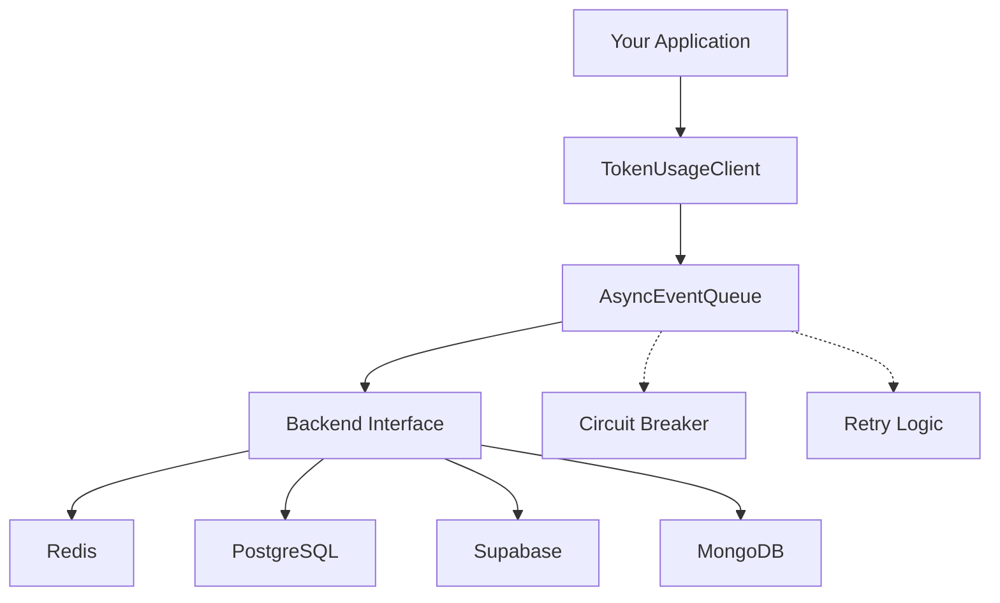

## Overview

Token Usage Metrics is a production-ready Python package for tracking LLM and embedding token usage with multi-backend support (Redis, PostgreSQL/Supabase, MongoDB). Built for high-performance applications with lifetime retention, project-based deletion, comprehensive aggregations, and non-blocking async operations.

## Features

<CardGroup cols={2}>
  <Card title="Multi-Backend Support" icon="database" iconType="duotone">
    Redis, PostgreSQL, Supabase, and MongoDB backends with unified API
  </Card>
  <Card title="Rich Aggregations" icon="chart-line" iconType="duotone">
    Daily summaries, project/type grouping, and time-series for dashboards
  </Card>
  <Card title="Async-First" icon="bolt" iconType="duotone">
    Non-blocking operations with background flushing and circuit breakers
  </Card>
  <Card title="Lifetime Retention" icon="infinity" iconType="duotone">
    No enforced TTL; explicit project-based deletion with date ranges
  </Card>
  <Card title="Flexible Queries" icon="magnifying-glass" iconType="duotone">
    Raw event fetching with filters and cursor-based pagination
  </Card>
  <Card title="Production-Ready" icon="shield-check" iconType="duotone">
    Structured logging, retry logic, graceful fallbacks, and health checks
  </Card>
</CardGroup>

## Installation

<CodeGroup>

```bash Redis (Recommended)
uv add token-usage-metrics[redis]
```

```bash All Backends
uv add token-usage-metrics[all]
```

```bash PostgreSQL
uv add token-usage-metrics[postgres]
```

```bash MongoDB
uv add token-usage-metrics[mongo]
```

</CodeGroup>

## Quick Start

<Steps>
  <Step title="Initialize the Client">
    Simple 3-line setup to get started:
    
    ```python
    import asyncio
    from token_usage_metrics import TokenUsageClient

    async def main():
        client = await TokenUsageClient.init("redis://localhost:6379/0")
    ```

  </Step>
  
  <Step title="Log Token Usage">
    Track your LLM token consumption:
    
    ```python
        await client.log("my_app", "chat", input_tokens=100, output_tokens=50)
    ```
  </Step>
  
  <Step title="Query Events">
    Retrieve and analyze usage data:
    
    ```python
        events, _ = await client.query(project="my_app")
        print(f"Found {len(events)} events")
        await client.aclose()

    asyncio.run(main())
    ```

  </Step>
</Steps>

## Example with More Features

```python
from datetime import datetime, timedelta, timezone

async def main():
    client = await TokenUsageClient.init("redis://localhost:6379/0")

    # Log usage with metadata
    await client.log(
        "chatbot", "chat",
        input_tokens=100, output_tokens=50,
        metadata={"model": "gpt-4", "user": "alice"}
    )

    # Query events
    events, _ = await client.query(project="chatbot")

    # Get daily aggregates
    daily = await client.aggregate(
        group_by="day",
        time_from=datetime.now(timezone.utc) - timedelta(days=7)
    )

    for bucket in daily:
        print(f"{bucket.start.date()}: {bucket.metrics}")

    await client.aclose()
```

## Architecture



<Card title="Learn More" icon="book-open" href="/architecture">
  Dive deeper into the architecture and understand how the components work
  together
</Card>

## Performance

<CardGroup cols={3}>
  <Card title="Redis" icon="bolt">
    ~10k writes/sec ~5k reads/sec
  </Card>
  <Card title="PostgreSQL" icon="database">
    ~2k writes/sec ~10k reads/sec
  </Card>
  <Card title="MongoDB" icon="leaf">
    ~5k writes/sec ~8k reads/sec
  </Card>
</CardGroup>

<Info>
  Benchmarks on single-instance deployments. Scale horizontally for higher
  throughput.
</Info>

## Next Steps

<CardGroup cols={2}>
  <Card title="Quick Start Guide" icon="rocket" href="/quickstart">
    Get up and running in minutes
  </Card>
  <Card title="API Reference" icon="code" href="/api-reference/overview">
    Explore the complete API documentation
  </Card>
  <Card title="Backend Setup" icon="server" href="/backends/redis">
    Configure your preferred backend
  </Card>
  <Card
    title="Advanced Configuration"
    icon="sliders"
    href="/advanced/configuration"
  >
    Fine-tune for your use case
  </Card>
</CardGroup>
