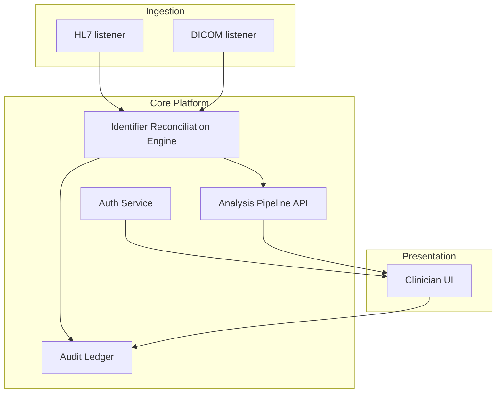

# Functional Design Spec

This document provides a high-level architectural view of the TraceFlow demo and links each design decision to the requirements, tests, and clinical safety risks that drive them. Refer to **RISK-001** when assessing identifier safety controls described below.

## Architecture overview

The system is split into ingestion, orchestration, and presentation tiers in order to satisfy **REQ-001** through **REQ-004** while maintaining a clean boundary for audit logging (**REQ-005**).

## Identifier reconciliation engine (REQ-005, RISK-001, TEST-002)

The reconciliation engine protects against the hazardous situation captured in **RISK-001** where patient and study identifiers might be mismatched. Design goals:

- Compare the DICOM `PatientID` and `AccessionNumber` with the HL7 metadata stream.
- If mismatches are detected, the transaction is quarantined and **TEST-002** exercises the operator override.
- Successful transactions emit structured audit events so **REQ-005** is met.

### UML activity view

1. Receive the incoming DICOM objects and perform schema checks.
2. Compare HL7 metadata with extracted tags and branch depending on whether identifiers match.
3. Persist successful studies and emit reconciliation metrics for **RISK-001**.
4. Quarantine mismatches and require an operator acknowledgement that is captured by **TEST-002**.

## Authentication and authorization (REQ-001, TEST-001)

Authentication relies on OpenID Connect so automated tests (**TEST-001**) can exercise both success and failure paths. Tokens carry the clinician's study permissions, and the middleware enforces them for every API endpoint.

## Imaging pipeline (REQ-002, REQ-003, RISK-002)

The MRI import module normalizes DICOM before invoking the analysis pipelines described in **REQ-003**. The pipelines emit validation artifacts:

- DICOM specific logs for regulatory review.
- Image-derived measurements tied to their source requirement/test pairs.
- Alerts for saturation or out-of-range values, contributing to **RISK-002** mitigations.

## Operational documents (General IUS)

Operational guidance for installations is maintained in `docs/ius.md`. That supplemental document links directly to **TEST-003** for continuous integration evidence and references **RISK-002** to remind the operator of the residual hazards.
