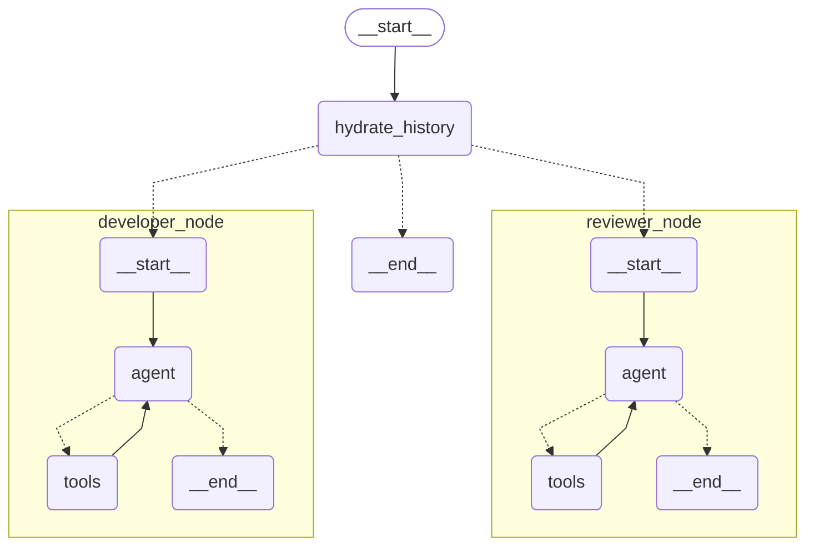

# GitHub Helper Agent

This project demonstrates how to create a GitHub Helper Agent using LangGraph with UiPathAzureChatOpenAI that interacts with Github via the official GitHub MCP Server deployed on UiPath infrastructure.

## Overview

The agent uses:
- LangGraph for orchestration
- UiPath hosted GitHub MCP server

The agent consists of three main components:

1. [GitHub action to deploy](https://github.com/UiPath/uipath-mcp-python/blob/main/docs/how_to_pack_binary.md) the official GitHub MCP Server to UiPath
2. [GitHub action](https://github.com/UiPath/uipath-mcp-python/blob/main/.github/workflows/trigger-github-agent.yml) that triggers this agent on "/help command"
3. The GitHub helper agent itself with developer and reviewer nodes

## Command Structure

The agent responds to the following commands:

- Reviewer: `/help summarize`, `/help suggest`, `/help review`, `/help test`
- Developer: `/help commit` (commits the latest suggestion/review/tests)

## Architecture



## Prerequisites

- Python 3.10+
- `langchain-mcp-adapters`
- `langgraph`
- `uipath-langchain`

## Installation

```bash
uv venv -p 3.11 .venv
.venv\Scripts\activate
uv sync
```

Set your MCP Remote Server URL as environment variables in `.env`:

```bash
UIPATH_MCP_SERVER_URL=https://cloud.uipath.com/account/tenant/agenthub_/mcp/folder-key/github-mcp/
```

## Debugging

For debugging issues:

1. Check logs for any connection or runtime errors:
```bash
uipath run agent '{"owner": "uipath", "repo": "uipath-mcp-python", "pullNumber": 78, "command": "summarize", "in_reply_to": 2060859623}'
```
2. Verify that the GitHub MCP Server is properly deployed and accessible.
3. Check GitHub Action logs for any issues with command triggers.


