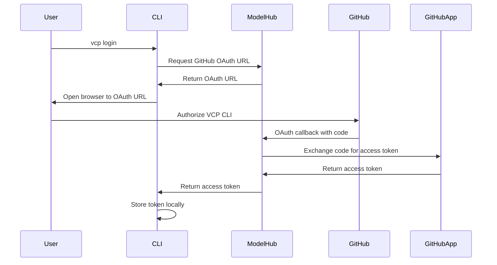
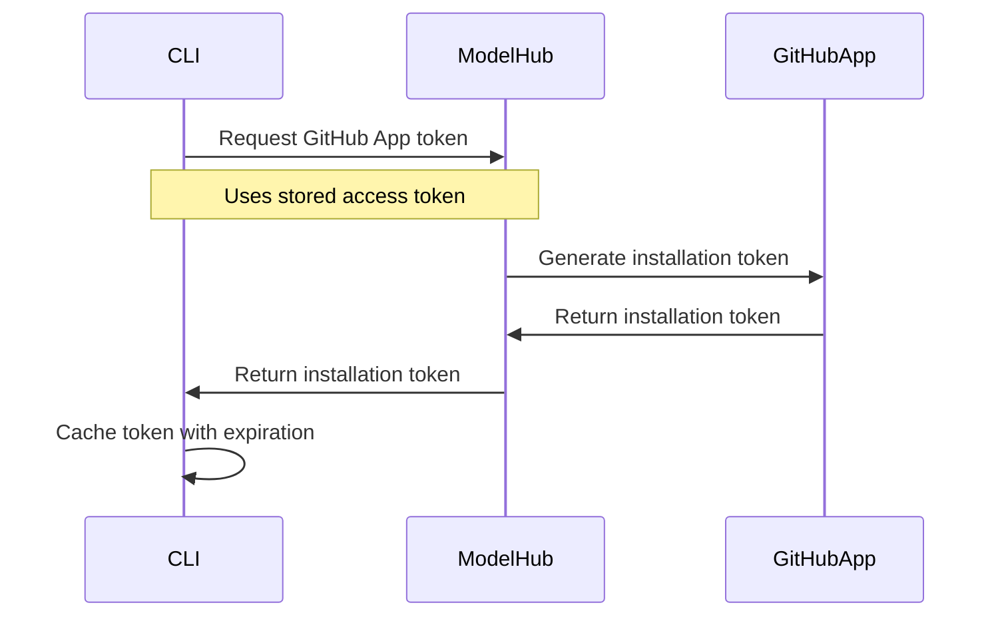
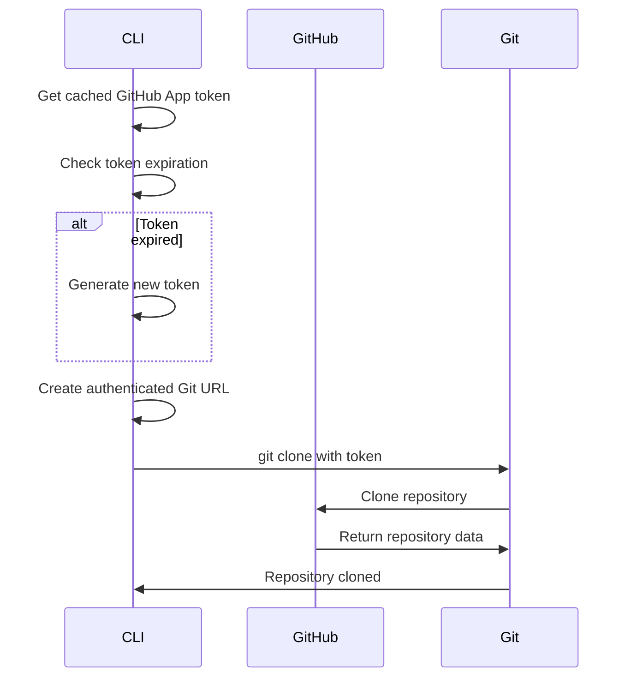

# GitHub Authentication System

This document explains how the GitHub authentication system works in the VCP CLI, including the GitHub App setup, authentication flow, and implementation details.

## Overview

The VCP CLI uses GitHub App authentication to interact with GitHub repositories. This provides secure, token-based authentication that works across different environments and doesn't require user passwords.

## GitHub App Configuration

### App Details
The VCP CLI uses a GitHub App for authentication. The specific App ID and Installation ID vary by environment:

#### Staging Environment Example
- **App ID**: `123456` (example)
- **Installation ID**: `789012` (example)
- **App Name**: `vcp-cli-staging`
- **Organization**: `cz-model-contributions`

#### Production Environment
- **App ID**: `654321` (example)
- **Installation ID**: `210987` (example)
- **App Name**: `vcp-cli-production`
- **Organization**: `cz-model-contributions`

### App Permissions
The GitHub App has the following permissions:
- **Repository access**: Read and write access to repositories in the `cz-model-contributions` organization
- **Contents**: Read and write access to repository contents
- **Metadata**: Read access to repository metadata
- **Pull requests**: Read and write access to pull requests

## Authentication Flow

### 1. Initial Authentication


### 2. GitHub App Token Generation


### 3. Git Operations


## Implementation Details

### Token Management

#### TokenInfo Class
```python
@dataclass
class TokenInfo:
    """Immutable token information with expiration tracking."""
    token: str
    expires_at: float
    created_at: float
    
    @property
    def is_expired(self) -> bool:
        """Check if token is expired with 5-minute safety buffer."""
        return time.time() >= (self.expires_at - 300)
    
    @property
    def is_valid(self) -> bool:
        """Check if token is valid (not expired and not None)."""
        return bool(self.token and not self.is_expired)
```

#### Token Caching
- Tokens are cached in memory with expiration tracking
- Automatic refresh when tokens expire
- Thread-safe caching using `threading.RLock`

### Authentication Methods

#### 1. Askpass Script Method
```python
# Create temporary askpass script
askpass_script = f"#!/bin/sh\necho '{token}'\n"
os.environ["GIT_ASKPASS"] = askpass_path
```

#### 2. Embedded Token URL Method
```python
# Embed token directly in URL
auth_url = repo_url.replace(
    "https://github.com/", 
    f"https://{token}@github.com/"
)
```

#### 3. Fallback Mechanism
If askpass script creation fails (e.g., `/tmp` not writable):
1. Try current working directory
2. Try user's home directory
3. Fall back to embedded token URL

### Error Handling

#### Circuit Breaker Pattern
```python
def _is_circuit_breaker_open(self) -> bool:
    """Check if circuit breaker is open due to repeated failures."""
    if self._api_failure_count >= 5:
        return (time.time() - self._last_failure_time) < 300  # 5 minutes
    return False
```

#### Retry Logic
```python
def _generate_new_token(self) -> str:
    """Generate a new token with retry logic and error handling."""
    for attempt in range(1, self.max_retries + 1):
        try:
            # API call logic
            return token
        except Exception as e:
            if attempt == self.max_retries:
                self._api_failure_count += 1
                self._last_failure_time = time.time()
                raise
            time.sleep(2 ** attempt)  # Exponential backoff
```

## Environment-Specific Configuration

### Staging Environment
```yaml
# config.yaml
models:
  base_url: "https://staging-api.modelhub.example.com"
  github_app_id: "123456"
  github_installation_id: "789012"
```

### Production Environment
```yaml
# config.yaml
models:
  base_url: "https://api.modelhub.example.com"
  github_app_id: "654321"
  github_installation_id: "210987"
```

## Security Considerations

### Token Security
- Tokens are stored in memory only (not persisted to disk)
- Tokens expire after 1 hour (GitHub App limitation)
- 5-minute safety buffer for token expiration
- Automatic cleanup of temporary files

### Network Security
- All API calls use HTTPS
- Tokens are never logged or exposed in error messages
- Environment variables are properly cleaned up

### Access Control
- GitHub App is installed only in the `cz-model-contributions` organization
- Repository access is limited to specific repositories
- Tokens are scoped to the specific installation

## Troubleshooting

### Common Issues

#### 1. "Authentication failed" Error
```
fatal: Authentication failed for 'https://github.com/...'
```
**Solution**: Run `vcp login` to refresh authentication

#### 2. "Text file busy" Error
```
fatal: cannot exec '/tmp/tmpywa5r8aq.sh': Text file busy
```
**Solution**: The system automatically falls back to embedded token URL

#### 3. "Terminal prompts disabled" Error
```
fatal: could not read Password for 'https://ghs_...': terminal prompts disabled
```
**Solution**: The system uses embedded token URL instead of askpass script

#### 4. Token Expiration
```
GitHub token API is temporarily unavailable due to repeated failures
```
**Solution**: Wait 5 minutes for circuit breaker to reset, or run `vcp login`

### Debug Mode
Enable debug logging to troubleshoot authentication issues:
```bash
VCP_LOG_LEVEL=DEBUG vcp model init --model-name test --model-version v1 --license-type MIT --work-dir /tmp/test
```

## Testing

### Unit Tests
```bash
make test
```

### Integration Tests
```bash
make test-integration
```

### Authentication-Specific Tests
```bash
uv run pytest tests/test_github_auth_token_caching.py -v
uv run pytest tests/integration/test_github_operations.py -v
```

## API Endpoints

### Token Generation
```
POST /api/github/contribution/app/token
Authorization: Bearer {user_access_token}
```

**Response**:
```json
{
  "token": "ghs_...",
  "expires_in": 3600
}
```

### Token Validation
The system automatically validates tokens by:
1. Checking expiration time
2. Testing token with a simple API call
3. Refreshing if validation fails

## Monitoring and Logging

### Log Levels
- **DEBUG**: Token generation, caching, and Git operations
- **INFO**: Authentication success/failure
- **WARNING**: Fallback mechanisms and retries
- **ERROR**: Authentication failures and circuit breaker activation

### Metrics
- Token generation frequency
- Authentication success rate
- Circuit breaker activations
- Fallback mechanism usage

## Future Improvements

### Planned Enhancements
1. **Token Refresh**: Automatic background token refresh
2. **Metrics**: Detailed authentication metrics
3. **Caching**: Persistent token caching (encrypted)
4. **Multi-tenant**: Support for multiple GitHub organizations

### Security Enhancements
1. **Token Rotation**: More frequent token rotation
2. **Audit Logging**: Comprehensive audit trail
3. **Rate Limiting**: API rate limiting protection
4. **Encryption**: Encrypted token storage
